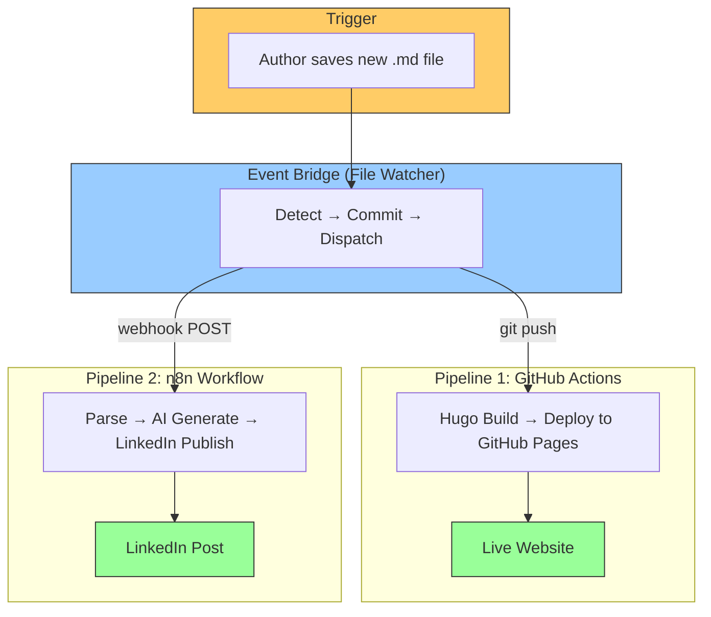

# n8n-Powered Auto Web Publish

> Automated blog publishing pipeline: Write a markdown post, and it automatically builds your Hugo site via GitHub Actions, deploys to GitHub Pages, and announces it on LinkedIn with an AI-generated summary — all orchestrated through n8n and a lightweight file watcher.

---

## The Integration Story

This project demonstrates how **n8n workflow automation** and **GitHub Actions CI/CD** can be integrated to create a **zero-touch publishing pipeline**. A single file creation event triggers two parallel systems — one for building and deploying the website, another for AI-powered social media promotion — without any manual intervention.



## How It Works

1. **Write** a new markdown post in your Hugo project's `content/posts/` directory
2. **fswatch** detects the new file
3. **Watcher script** commits the post to the Hugo repo and pushes to GitHub
4. **GitHub Actions** (auto-triggered by push) builds the Hugo site and deploys to GitHub Pages
5. **n8n webhook** (called by watcher) receives the post content
6. **Hugging Face AI** (Meta-Llama 3.1 via SambaNova) generates a compelling LinkedIn summary
7. **LinkedIn API** publishes the AI-crafted post with an article link to your profile

**Key Design**: GitHub Actions handles build/deploy. n8n handles AI/social. Neither duplicates the other's work.

## Documentation

| Document | Description |
|---|---|
| [Architecture](docs/architecture.md) | High-level and low-level architecture, PlantUML system flows, integration patterns |
| [Setup Guide](docs/setup-guide.md) | Step-by-step setup for n8n, GitHub, credentials, and the watcher |
| [Workflow Documentation](docs/workflow-documentation.md) | Node-by-node n8n workflow docs, GitHub Actions pipeline details |

## Quick Start

```bash
# 1. Clone the repo
git clone https://github.com/thatsmeadarsh/n8n-powered-auto-web-publish.git
cd n8n-powered-auto-web-publish

# 2. Create your config
cp config.sample.env config.env
# Edit config.env with your paths and tokens

# 3. Start n8n (Docker)
docker run -d --name n8n --restart unless-stopped \
  -p 5678:5678 \
  -v n8n_data:/home/node/.n8n \
  -e NODE_TLS_REJECT_UNAUTHORIZED=0 \
  docker.n8n.io/n8nio/n8n

# 4. Import the workflow in n8n UI (http://localhost:5678)
# Import: workflows/auto-publish-workflow.json
# Configure credentials: HuggingFace Header Auth + LinkedIn OAuth2

# 5. Start the file watcher
./scripts/watch-and-publish.sh
```

## Project Structure

```
n8n-powered-auto-web-publish/
├── README.md                  # This file
├── config.sample.env          # Template configuration (committed)
├── config.env                 # Your local config (gitignored)
├── .gitignore
├── scripts/
│   └── watch-and-publish.sh   # File watcher + git commit + webhook trigger
├── workflows/
│   └── auto-publish-workflow.json  # n8n workflow (importable)
├── docs/
│   ├── architecture.md        # Architecture documentation
│   ├── setup-guide.md         # Setup instructions
│   └── workflow-documentation.md  # Workflow details
└── screenshots/
    └── n8n-workflow-complete.png   # n8n workflow screenshot
```

## Architecture Summary

| Component | Runs On | Responsibility |
|---|---|---|
| **File Watcher** | Host (macOS) | Detect new posts, commit to Git, trigger n8n |
| **GitHub Actions** | GitHub Cloud | Hugo build, cross-repo deploy to GitHub Pages |
| **n8n** | Docker (local) | AI content generation, LinkedIn publishing |
| **Hugging Face** | Cloud API | Text generation (Meta-Llama 3.1 via SambaNova) |
| **LinkedIn** | Cloud API | Social media posting (OAuth2) |

## Tech Stack

- **n8n** (v2.11+) — Workflow automation engine (Docker)
- **GitHub Actions** — CI/CD pipeline for Hugo build + deploy
- **Hugo** — Static site generator (Ananke theme)
- **GitHub Pages** — Static site hosting
- **Hugging Face Inference API** — AI text generation
- **LinkedIn API** — Social media posting (OAuth2)
- **fswatch** — macOS file system event monitoring

---

**Author**: Adarsh Murali
**License**: MIT
