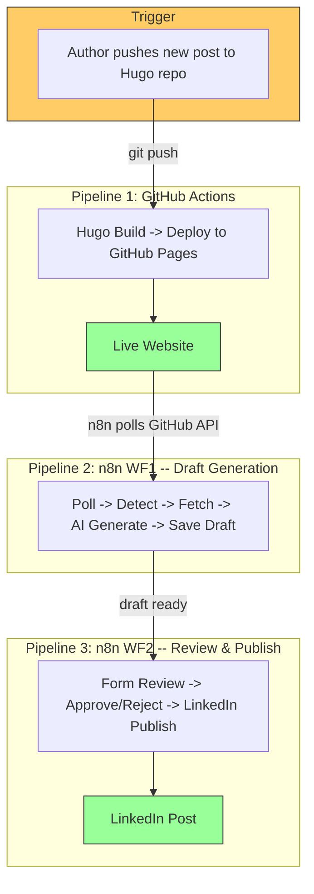

# n8n-Powered Auto Web Publish

> Automated blog publishing pipeline: Write a markdown post, push to your Hugo repo, and GitHub Actions builds and deploys your site to GitHub Pages. n8n polls for new deployments, generates an AI-powered LinkedIn draft, and publishes it -- with one intentional human review step before LinkedIn posting.

---

## The Integration Story

This project demonstrates how **n8n workflow automation** and **GitHub Actions CI/CD** can be integrated to create a **human-in-the-loop publishing pipeline**. A single `git push` triggers GitHub Actions for building and deploying the website. Then two n8n workflows handle the rest: **Workflow 1** detects the new deployment and generates an AI-powered LinkedIn draft, while **Workflow 2** presents a form-based review step where the author can approve, edit, or reject the draft before it goes live on LinkedIn.



## How It Works

1. **Write** a new markdown post in your Hugo project's `content/posts/` directory
2. **Commit and push** to the Hugo repo's `main` branch
3. **GitHub Actions** (auto-triggered by push) builds the Hugo site and deploys to GitHub Pages
4. **n8n WF1** polls the Pages repo every 5 minutes, detects the new deployment commit
5. **n8n WF1** extracts the new post slug, fetches the original markdown, and uses **Hugging Face AI** (Meta-Llama 3.1 via SambaNova) to generate a LinkedIn draft -- then saves it to the draft queue
6. **Author** opens the review form at `http://localhost:5678/form/linkedin-review-form`
7. **n8n WF2** loads the pending draft; the author reviews, edits if needed, and approves or rejects
8. **On approve**: LinkedIn API publishes the post. **On reject**: draft is removed from the queue.

**Key Design**: GitHub Actions handles build/deploy. Two n8n workflows split the automation: WF1 handles detection, AI generation, and draft storage; WF2 provides a form-based human review gate before anything reaches LinkedIn.

### Workflow 1: Generate LinkedIn Draft


### Workflow 2: Review & Publish to LinkedIn


## Documentation

| Document | Description |
|---|---|
| [Architecture](docs/architecture.md) | High-level and low-level architecture, PlantUML system flows, integration patterns |
| [Setup Guide](docs/setup-guide.md) | Step-by-step setup for n8n, GitHub, and credentials |
| [Workflow Documentation](docs/workflow-documentation.md) | Node-by-node n8n workflow docs, GitHub Actions pipeline details |

## Quick Start

```bash
# 1. Clone the repo
git clone https://github.com/thatsmeadarsh/n8n-powered-auto-web-publish.git
cd n8n-powered-auto-web-publish

# 2. Start n8n (Docker)
docker run -d --name n8n --restart unless-stopped \
  -p 5678:5678 \
  -v n8n_data:/home/node/.n8n \
  -e NODE_TLS_REJECT_UNAUTHORIZED=0 \
  docker.n8n.io/n8nio/n8n

# 3. Import both workflows in n8n UI (http://localhost:5678)
# Import: workflows/auto-publish-workflow.json (WF1: Draft Generation)
# Import: workflows/review-and-publish-workflow.json (WF2: Review & Publish)
# Configure credentials: GitHub API, HuggingFace Header Auth, LinkedIn OAuth2, n8n Internal API

# 4. Activate both workflows
# WF1 starts polling every 5 minutes
# WF2 is always active, waiting for form submissions at:
#   http://localhost:5678/form/linkedin-review-form
```

## Project Structure

```
n8n-powered-auto-web-publish/
+-- README.md
+-- .gitignore
+-- workflows/
|   +-- auto-publish-workflow.json       # WF1: Draft Generation (importable)
|   +-- review-and-publish-workflow.json  # WF2: Review & Publish (importable)
+-- docs/
|   +-- architecture.md
|   +-- setup-guide.md
|   +-- workflow-documentation.md
+-- screenshots/
    +-- generate-linkedin-draft-n8n.png      # WF1 workflow canvas
    +-- review-and-publish-linkedin-n8n.png   # WF2 workflow canvas
```

## Architecture Summary

| Component | Runs On | Responsibility |
|---|---|---|
| **GitHub Actions** | GitHub Cloud | Hugo build, cross-repo deploy to GitHub Pages |
| **n8n WF1** | Docker (local) | Poll for deployments, fetch content, AI draft generation, save to queue |
| **n8n WF2** | Docker (local) | Form-based review, approve/reject gate, LinkedIn publishing |
| **Hugging Face** | Cloud API | Text generation (Meta-Llama 3.1 via SambaNova) |
| **LinkedIn** | Cloud API | Social media posting (OAuth2) |

## Tech Stack

- **n8n** (v2.11+) -- Workflow automation engine (Docker)
- **GitHub Actions** -- CI/CD pipeline for Hugo build + deploy
- **GitHub API** -- Polled by n8n to detect new deployments
- **Hugo** -- Static site generator (Ananke theme)
- **GitHub Pages** -- Static site hosting
- **Hugging Face Inference API** -- AI text generation
- **LinkedIn API** -- Social media posting (OAuth2)

---

**Author**: Adarsh Murali
**License**: MIT
