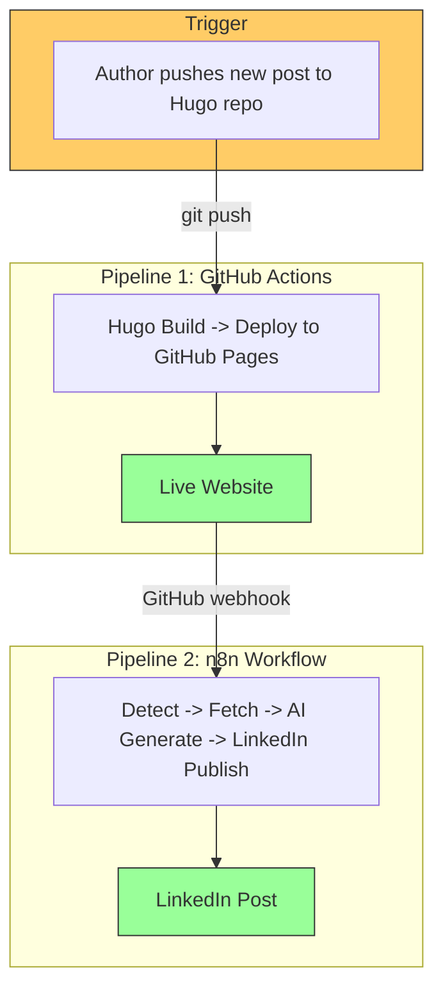

# n8n-Powered Auto Web Publish

> Automated blog publishing pipeline: Write a markdown post, push to your Hugo repo, and GitHub Actions builds and deploys your site to GitHub Pages. Once deployed, n8n detects the new post via GitHub webhook, generates an AI-powered LinkedIn summary, and publishes it -- fully automated, zero manual steps.

---

## The Integration Story

This project demonstrates how **n8n workflow automation** and **GitHub Actions CI/CD** can be integrated to create a **zero-touch publishing pipeline**. A single `git push` triggers two sequential systems -- GitHub Actions for building and deploying the website, then n8n for AI-powered social media promotion -- without any manual intervention.



## How It Works

1. **Write** a new markdown post in your Hugo project's `content/posts/` directory
2. **Commit and push** to the Hugo repo's `main` branch
3. **GitHub Actions** (auto-triggered by push) builds the Hugo site and deploys to GitHub Pages
4. **GitHub webhook** notifies n8n when the Pages repo receives the deployed content
5. **n8n** extracts the new post slug, fetches the original markdown from the Hugo source repo
6. **Hugging Face AI** (Meta-Llama 3.1 via SambaNova) generates a compelling LinkedIn summary
7. **LinkedIn API** publishes the AI-crafted post with an article link to your profile

**Key Design**: GitHub Actions handles build/deploy. n8n handles detection, AI, and social -- triggered only after the site is live.

## Documentation

| Document | Description |
|---|---|
| [Architecture](docs/architecture.md) | High-level and low-level architecture, PlantUML system flows, integration patterns |
| [Setup Guide](docs/setup-guide.md) | Step-by-step setup for n8n, GitHub, credentials, and webhook configuration |
| [Workflow Documentation](docs/workflow-documentation.md) | Node-by-node n8n workflow docs, GitHub Actions pipeline details |

## Quick Start

```bash
# 1. Clone the repo
git clone https://github.com/thatsmeadarsh/n8n-powered-auto-web-publish.git
cd n8n-powered-auto-web-publish

# 2. Start n8n (Docker)
docker run -d --name n8n --restart unless-stopped \
  -p 5678:5678 \
  -v n8n_data:/home/node/.n8n \
  -e NODE_TLS_REJECT_UNAUTHORIZED=0 \
  -e WEBHOOK_URL=https://your-tunnel-url.ngrok-free.app \
  docker.n8n.io/n8nio/n8n

# 3. Expose n8n via tunnel (required for GitHub webhooks)
ngrok http 5678

# 4. Import the workflow in n8n UI (http://localhost:5678)
# Import: workflows/auto-publish-workflow.json
# Configure credentials: GitHub API, HuggingFace Header Auth, LinkedIn OAuth2

# 5. Activate the workflow -- n8n auto-registers the GitHub webhook
```

## Project Structure

```
n8n-powered-auto-web-publish/
+-- README.md                  # This file
+-- .gitignore
+-- workflows/
|   +-- auto-publish-workflow.json  # n8n workflow (importable)
+-- docs/
|   +-- architecture.md        # Architecture documentation
|   +-- setup-guide.md         # Setup instructions
|   +-- workflow-documentation.md  # Workflow details
+-- screenshots/
    +-- n8n-workflow-complete.png   # n8n workflow screenshot
```

## Architecture Summary

| Component | Runs On | Responsibility |
|---|---|---|
| **GitHub Actions** | GitHub Cloud | Hugo build, cross-repo deploy to GitHub Pages |
| **GitHub Webhook** | GitHub Cloud | Notifies n8n when Pages repo receives a push |
| **n8n** | Docker (local + tunnel) | Detect new posts, fetch content, AI generation, LinkedIn publishing |
| **Hugging Face** | Cloud API | Text generation (Meta-Llama 3.1 via SambaNova) |
| **LinkedIn** | Cloud API | Social media posting (OAuth2) |

## Tech Stack

- **n8n** (v2.11+) -- Workflow automation engine (Docker)
- **GitHub Actions** -- CI/CD pipeline for Hugo build + deploy
- **GitHub Webhooks** -- Event-driven notification to n8n
- **Hugo** -- Static site generator (Ananke theme)
- **GitHub Pages** -- Static site hosting
- **Hugging Face Inference API** -- AI text generation
- **LinkedIn API** -- Social media posting (OAuth2)
- **ngrok / Cloudflare Tunnel** -- Expose local n8n to GitHub webhooks

---

**Author**: Adarsh Murali
**License**: MIT
