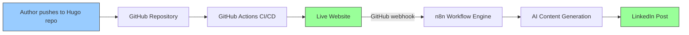
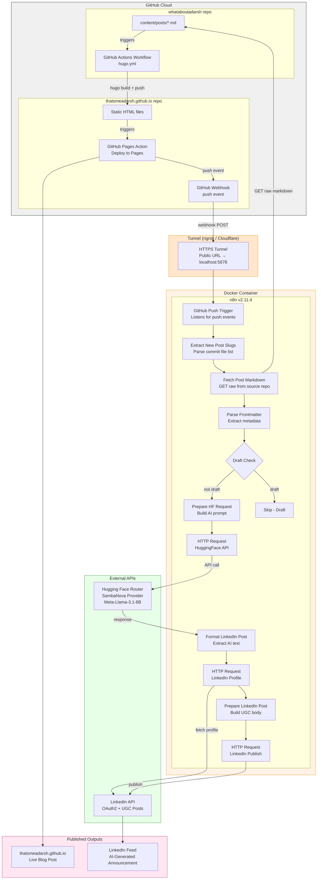
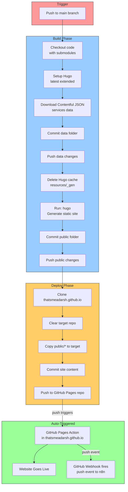
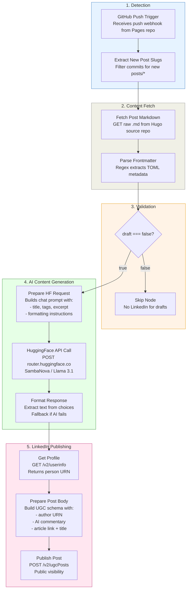
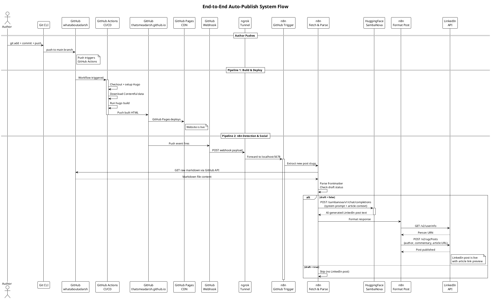
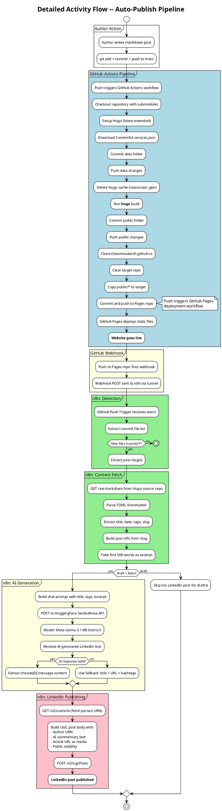
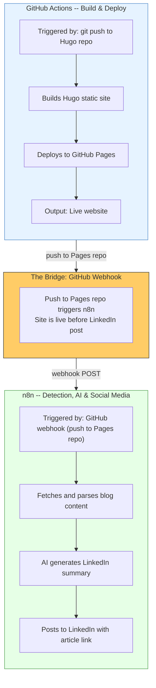

# Architecture Documentation

> A seamless integration of n8n workflow automation with GitHub Actions CI/CD -- turning a single `git push` into a live blog post with an AI-crafted LinkedIn announcement, all without manual intervention.

---

## High-Level Architecture

At a glance, the system transforms a markdown file into a published blog post and LinkedIn announcement through two sequential systems working in concert:



| Layer | System | Responsibility |
|---|---|---|
| **Build & Deploy** | GitHub Actions | Hugo build, static site deployment |
| **Event Detection** | GitHub Webhook | Notifies n8n when the Pages repo receives deployed content |
| **AI & Social** | n8n + Hugging Face + LinkedIn | Fetch post, AI summary generation, social publishing |

**The key insight**: GitHub webhooks act as the **event bridge** -- the Pages repo push (deployment complete) triggers n8n to fetch the post content, generate an AI summary, and publish to LinkedIn. The LinkedIn post only goes out after the site is live.

---

## High-Level System Flow

```
                    ┌─────────────────────────────────────────────┐
                    │            AUTHOR'S MACHINE                  │
                    │                                              │
                    │   1. Write markdown post                     │
                    │   2. git add + commit + push                 │
                    │                                              │
                    └──────────────────┬───────────────────────────┘
                                       │
                              git push │
                                       │
                    ┌──────────────────▼───────────────────────────┐
                    │          GITHUB CLOUD                         │
                    │                                               │
                    │   ┌─────────────────────┐                     │
                    │   │  GitHub Actions      │                    │
                    │   │  Hugo Build + Deploy │                    │
                    │   └──────────┬──────────┘                     │
                    │              │                                 │
                    │     push to Pages repo                        │
                    │              │                                 │
                    │   ┌──────────▼──────────┐                     │
                    │   │  GitHub Pages        │──── Website Live    │
                    │   └──────────┬──────────┘                     │
                    │              │                                 │
                    │     webhook fires                             │
                    │              │                                 │
                    └──────────────┼────────────────────────────────┘
                                   │
                    ┌──────────────▼────────────────────────────────┐
                    │          n8n (Docker + Tunnel)                 │
                    │                                               │
                    │   Detect new posts → Fetch markdown           │
                    │   → AI summary → LinkedIn publish             │
                    │                                               │
                    └──────────────┬────────────────────────────────┘
                                   │
                    ┌──────────────▼──────────┐
                    │     LinkedIn Feed        │
                    │     (AI-Generated Post)  │
                    └─────────────────────────┘
```

---

## Low-Level Architecture

### Complete System Component Diagram



---

### Low-Level: GitHub Actions Pipeline

The `whataboutadarsh` repo contains a GitHub Actions workflow that triggers on every push to `main`. This is the **build and deploy** engine.



**Key Details**:

| Step | Action | Purpose |
|---|---|---|
| Checkout | `actions/checkout@v3` with submodules | Fetches Hugo theme as git submodule |
| Contentful | `curl` to Contentful CDN | Downloads latest services data for the Services page |
| Hugo Build | `hugo` command | Compiles markdown + Ananke theme into static HTML |
| Cross-Repo Push | `git push` with PAT | Pushes built HTML to the GitHub Pages repository |
| Authentication | `PERSONAL_ACCESS_TOKEN` secret | Enables cross-repository push access |
| Webhook | GitHub webhook on Pages repo | Notifies n8n that deployment is complete |

### Low-Level: n8n Workflow Pipeline

The n8n workflow handles everything after deployment -- detecting new posts, fetching content, AI generation, and social media publishing.



---

## System Flow Diagram (PlantUML)



---

## Detailed Activity Diagram (PlantUML)



---

## Integration Highlight: n8n + GitHub Actions

> **How we bridged workflow automation with CI/CD to create a zero-touch publishing pipeline**

The power of this architecture lies in how **n8n and GitHub Actions complement each other** without overlap or duplication:



### Why This Integration Works

| Principle | Implementation |
|---|---|
| **Separation of concerns** | GitHub Actions handles what it's best at (CI/CD, building, deploying). n8n handles what it's best at (API orchestration, AI integration, conditional logic). |
| **No duplication** | Build and deploy happen only in GitHub Actions. AI and social happen only in n8n. Neither system repeats the other's work. |
| **Sequential guarantee** | n8n only fires after the Pages repo receives the deployed content, ensuring the site is live before the LinkedIn post goes out. |
| **Event-driven** | GitHub webhooks provide real-time notification -- no polling, no file watchers, no host dependencies. |
| **Fault isolation** | If LinkedIn posting fails, the website is still live. If GitHub Actions fails, n8n never fires (no premature LinkedIn post). |
| **Zero manual steps** | From pushing a markdown file to a live website + LinkedIn announcement -- no human intervention required. |
| **No host dependencies** | No file watcher, no cron jobs, no background processes on the author's machine. Just `git push`. |

### The Integration Pattern

```
                    ┌─────────────────┐
                    │  Single Event   │
                    │  (git push)     │
                    └────────┬────────┘
                             │
                    ┌────────▼────────┐
                    │  GitHub Actions  │
                    │  Build + Deploy  │
                    └────────┬────────┘
                             │
                    ┌────────▼────────┐
                    │  GitHub Webhook  │
                    │  (push to Pages) │
                    └────────┬────────┘
                             │
                    ┌────────▼────────────────┐
                    │  n8n Workflow             │
                    │  ──────────────────       │
                    │  Detect new posts         │
                    │  Fetch markdown content   │
                    │  AI text generation       │
                    │  LinkedIn publishing      │
                    └────────┬─────────────────┘
                             │
                    ┌────────▼────────────────┐
                    │  LINKEDIN POST           │
                    │  AI-crafted summary      │
                    │  with article link       │
                    └─────────────────────────┘
```

This pattern is **reusable** -- the same webhook-driven approach can integrate any CI/CD pipeline with any workflow automation tool, enabling scenarios like:
- Auto-posting to Twitter/X, Mastodon, or other platforms
- Sending email newsletters for new posts
- Triggering SEO indexing via Google Search Console API
- Cross-posting to Medium or Dev.to

---

## Security Architecture


| Secret | Location | Scope | Expiry |
|---|---|---|---|
| GitHub PAT (Actions) | GitHub repo secret (`PERSONAL_ACCESS_TOKEN`) | `repo` + `workflow` | Configurable (90 days recommended) |
| GitHub PAT (n8n) | n8n credential store | `repo` + `admin:repo_hook` | Configurable |
| HuggingFace token | n8n credential store | Inference Providers only | No expiry |
| LinkedIn OAuth2 | n8n credential store (encrypted) | `w_member_social` | 2 months (auto-refreshed by n8n) |

### Security Boundaries

- **n8n** runs in Docker locally, exposed only via tunnel for webhook delivery
- **Tunnel** can be restricted to GitHub webhook IPs for additional security
- **n8n** runs with `NODE_TLS_REJECT_UNAUTHORIZED=0` (container-scoped, not host)
- **GitHub PAT** is stored in GitHub's encrypted secrets and n8n's encrypted credential store
- **Webhook secret** can be configured in n8n's GitHub Trigger for payload verification

---

## Design Decisions

| Decision | Rationale |
|---|---|
| **GitHub webhook over file watcher** | Eliminates host dependencies (fswatch, background scripts). Works from any machine that can `git push`. Guarantees site is deployed before LinkedIn post. |
| **Watch Pages repo, not Hugo repo** | Ensures the website is actually live before announcing on LinkedIn. The push to the Pages repo is the last step of deployment. |
| **Fetch markdown from source repo** | The Pages repo only has built HTML. The source repo has the original markdown with frontmatter for AI context. |
| **Tunnel for local n8n** | GitHub webhooks need a public URL. ngrok/Cloudflare Tunnel bridges local n8n to the internet with minimal setup. |
| **GitHub Actions for build/deploy** | Already configured and tested; Hugo + cross-repo push is complex to replicate elsewhere |
| **n8n for detection + AI + social** | Keeps n8n focused on what it excels at: event detection, API orchestration, and conditional logic |
| **HTTP Request nodes over LinkedIn node** | Built-in LinkedIn node doesn't support "Ignore SSL Issues" needed in Docker |
| **Code nodes for JSON construction** | Blog content contains special characters that break inline JSON templates |
| **SambaNova via HuggingFace Router** | Free tier, fast inference, OpenAI-compatible API format |
| **Draft check in n8n** | Allows deploying draft posts to test site rendering without triggering LinkedIn |

---

*Last Updated: 2026-03-14*
*Project: n8n-Powered Auto Web Publish*
