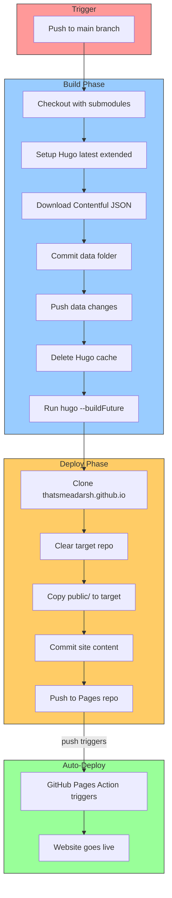
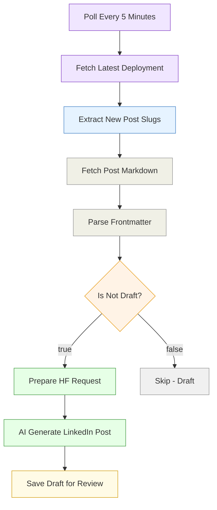
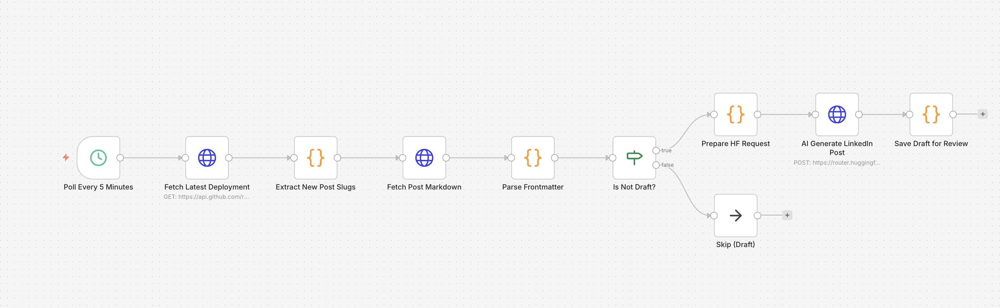
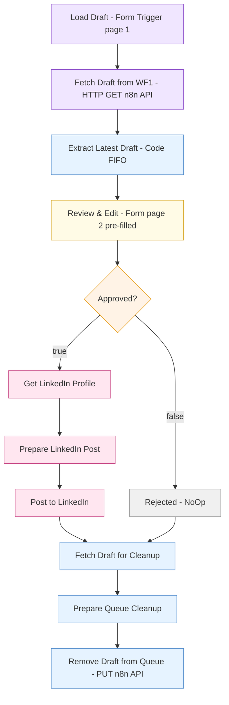
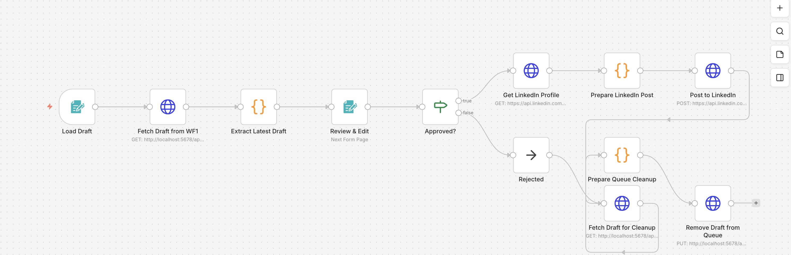
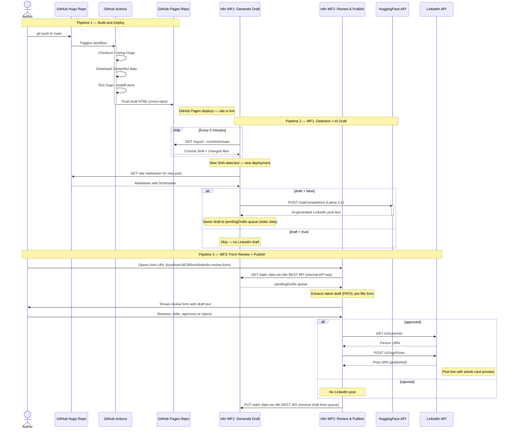
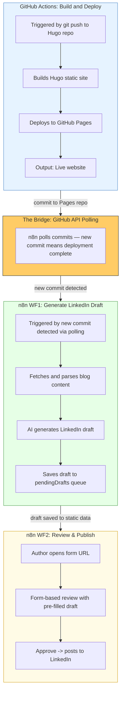
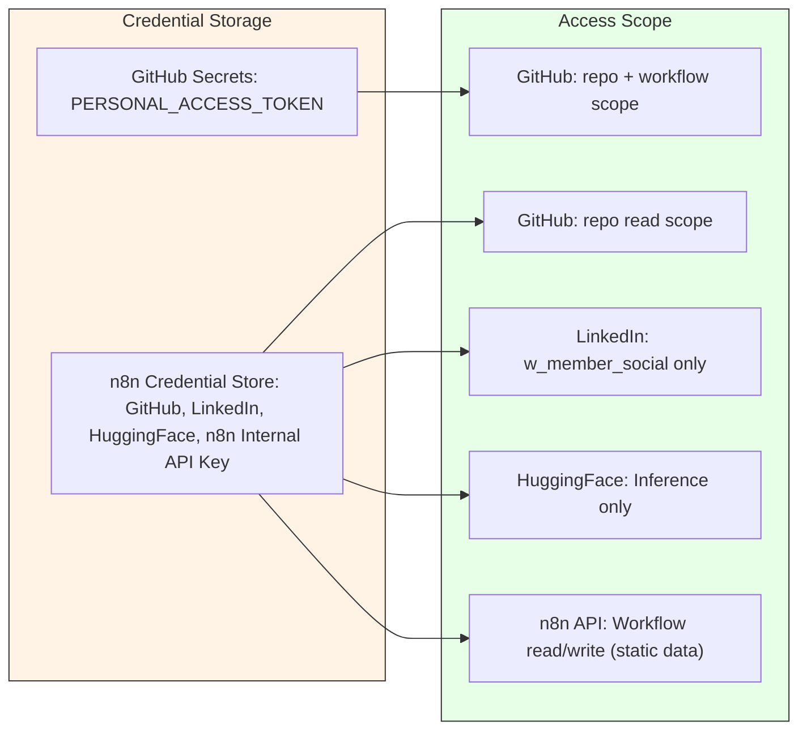

# Architecture Documentation

> A seamless integration of n8n workflow automation with GitHub Actions CI/CD -- turning a single `git push` into a live blog post with an AI-crafted LinkedIn announcement, with one intentional approval step before publishing.

---

## High-Level Architecture

At a glance, the system transforms a markdown file into a published blog post and LinkedIn announcement through two systems working in sequence:

```mermaid
graph LR
    A["Author pushes to Hugo repo"] --> C["GitHub Repository"]
    C --> E["GitHub Actions CI/CD"]
    E --> F["Live Website"]
    F -->|"n8n polls GitHub API"| WF1["WF1: Generate LinkedIn Draft"]
    WF1 -->|"saves draft"| WF2["WF2: Review & Publish"]
    WF2 -->|"author reviews via form"| H["LinkedIn Post"]

    style A fill:#99ccff,stroke:#333
    style F fill:#99ff99,stroke:#333
    style WF1 fill:#e6ffe6,stroke:#4a9e4a
    style WF2 fill:#fffbe6,stroke:#d4a017
    style H fill:#99ff99,stroke:#333
```



| Layer | System | Responsibility |
|---|---|---|
| **Build & Deploy** | GitHub Actions | Hugo build, static site deployment |
| **Detection + AI Draft** | n8n WF1: Generate LinkedIn Draft | Polls for new commits, fetches content, AI generates draft, saves to queue |
| **Review + Publish** | n8n WF2: Review & Publish to LinkedIn | Form-based review, author approves/rejects, publishes to LinkedIn |

**The key insight**: n8n WF1 polls the Pages repo for new commits. A new commit means deployment is complete. WF1 fetches the post content from the source repo, generates an AI LinkedIn draft, and saves it to a FIFO queue. WF2 provides a form-based review UI where the author can edit, approve, or reject the draft before it goes live on LinkedIn.

---

## High-Level System Flow

```
                    ┌─────────────────────────────────────────────┐
                    │            AUTHOR'S MACHINE                  │
                    │                                              │
                    │   1. Write markdown post                     │
                    │   2. git add + commit + push                 │
                    │                                              │
                    └──────────────────┬───────────────────────────┘
                                       │
                              git push │
                                       │
                    ┌──────────────────▼───────────────────────────┐
                    │          GITHUB CLOUD                         │
                    │                                               │
                    │   ┌─────────────────────┐                     │
                    │   │  GitHub Actions      │                    │
                    │   │  Hugo Build + Deploy │                    │
                    │   └──────────┬──────────┘                     │
                    │              │                                 │
                    │     push to Pages repo                        │
                    │              │                                 │
                    │   ┌──────────▼──────────┐                     │
                    │   │  GitHub Pages        │──── Website Live    │
                    │   └─────────────────────┘                     │
                    │                                               │
                    └───────────────────────────────────────────────┘
                                       ▲
                            polls every │ 5 min
                                       │
                    ┌──────────────────┴────────────────────────────┐
                    │          n8n (Docker)                          │
                    │                                               │
                    │   WF1: Generate LinkedIn Draft                 │
                    │   Poll → Detect → Fetch → AI → Save Draft     │
                    │                                               │
                    │   WF2: Review & Publish to LinkedIn            │
                    │   Form → Review → Approve/Reject → Publish    │
                    │   http://localhost:5678/form/linkedin-review-form
                    │                                               │
                    └──────────────────┬────────────────────────────┘
                                       │
                    ┌──────────────────▼──────────┐
                    │     LinkedIn Feed            │
                    │     (AI-Generated Post)      │
                    └─────────────────────────────┘
```

---

## Low-Level Architecture

### Complete System Component Diagram

```
┌─── GITHUB CLOUD ────────────────────────────────────────────────────────────┐
│                                                                              │
│  ┌── whataboutadarsh ────────────┐     ┌── thatsmeadarsh.github.io ──────┐  │
│  │  content/posts/*.md           │     │  Static HTML files              │  │
│  │  GitHub Actions (hugo.yml)    │────▶│  GitHub Pages CDN               │  │
│  └───────────────────────────────┘     │  REST API: /commits/main        │  │
│               ▲ GET raw .md            └─────────────────────────────────┘  │
│               │                                      │ polls every 5 min    │
└───────────────┼──────────────────────────────────────┼──────────────────────┘
                │                                      │
┌───────────────┼── DOCKER (n8n v2.11.4) ──────────────▼──────────────────────┐
│               │                                                              │
│  ┌── WF1: Generate LinkedIn Draft ───────────────────────────────────────┐  │
│  │            │                                                           │  │
│  │            │   Schedule Trigger                                        │  │
│  │            │         │                                                 │  │
│  │            │   Fetch Latest Deployment                                 │  │
│  │            │         │                                                 │  │
│  │            │   Extract New Post Slugs                                  │  │
│  │            │         │                                                 │  │
│  │            └── Fetch Post Markdown                                     │  │
│  │                       │                                                │  │
│  │                 Parse Frontmatter                                      │  │
│  │                       │                                                │  │
│  │          draft=true ──┤── draft=false                                  │  │
│  │               │                  │                                     │  │
│  │             Skip         Prepare HF Request                            │  │
│  │                                  │                                     │  │
│  │                          HuggingFace Call ───────▶ HuggingFace Router  │  │
│  │                                  │◀── AI post text   SambaNova / Llama│  │
│  │                          Save Draft for Review                         │  │
│  │                          (pendingDrafts queue)                         │  │
│  └────────────────────────────────────────────────────────────────────────┘  │
│                                      │                                       │
│                          n8n REST API │ (read static data)                   │
│                                      ▼                                       │
│  ┌── WF2: Review & Publish to LinkedIn ──────────────────────────────────┐  │
│  │                                                                        │  │
│  │   Load Draft (Form Trigger page 1)                                     │  │
│  │         │                                                              │  │
│  │   Fetch Draft from WF1 (HTTP GET n8n API)                              │  │
│  │         │                                                              │  │
│  │   Extract Latest Draft (Code, FIFO)                                    │  │
│  │         │                                                              │  │
│  │   Review & Edit (Form page 2, pre-filled)                              │  │
│  │         │                                                              │  │
│  │   Approved? ──────────────────────────┐                                │  │
│  │         │ true                         │ false                         │  │
│  │   Get LinkedIn Profile ──▶ LinkedIn   Rejected (NoOp)                  │  │
│  │         │◀── person URN     API       │                                │  │
│  │   Prepare LinkedIn Post               │                                │  │
│  │         │                             │                                │  │
│  │   POST /v2/ugcPosts ────▶ LinkedIn   │                                │  │
│  │         │                  API        │                                │  │
│  │         └─────────────────────────────┘                                │  │
│  │                     │                                                  │  │
│  │         Fetch Draft for Cleanup                                        │  │
│  │         Prepare Queue Cleanup                                          │  │
│  │         Remove Draft from Queue (PUT n8n API)                          │  │
│  └────────────────────────────────────────────────────────────────────────┘  │
│                                                                              │
│   Form URL: http://localhost:5678/form/linkedin-review-form                  │
└──────────────────────────────────────────────────────────────────────────────┘
                    │                               │
                    ▼                               ▼
        thatsmeadarsh.github.io             LinkedIn Feed
        (live blog post)                    (AI announcement)
```

---

### Low-Level: GitHub Actions Pipeline

The `whataboutadarsh` repo contains a GitHub Actions workflow that triggers on every push to `main`. This is the **build and deploy** engine.



**Key Details**:

| Step | Action | Purpose |
|---|---|---|
| Checkout | `actions/checkout@v4` with submodules | Fetches Hugo theme as git submodule |
| Contentful | `curl` to Contentful CDN | Downloads latest services data for the Services page |
| Hugo Build | `hugo --buildFuture` | Compiles markdown + Ananke theme into static HTML, including future-dated posts |
| Cross-Repo Push | `git push` with PAT | Pushes built HTML to the GitHub Pages repository |
| Authentication | `PERSONAL_ACCESS_TOKEN` secret | Enables cross-repository push access |
| public/ ignored | `.gitignore` excludes `public/` | Build artifacts not tracked in source repo; Pages repo updated via cross-repo push |

### Low-Level: n8n Workflow Pipeline

The n8n workflow handles everything after deployment -- polling for changes, fetching content, AI generation, and social media publishing.

#### WF1: Generate LinkedIn Draft (10 nodes)





#### WF2: Review & Publish to LinkedIn (10 nodes)





---

## System Flow Diagram (Sequence)



---

## Integration Highlight: n8n + GitHub Actions

> **How we bridged workflow automation with CI/CD to create a zero-touch publishing pipeline**



### Why This Integration Works

| Principle | Implementation |
|---|---|
| **Separation of concerns** | GitHub Actions handles CI/CD. n8n handles detection, AI, and social. |
| **No duplication** | Build and deploy happen only in GitHub Actions. AI and social happen only in n8n. |
| **Deployment guarantee** | n8n only fires after a new commit appears on the Pages repo, meaning deployment is complete. |
| **No host dependencies** | No file watcher, no tunnels, no background processes. Just `git push` and Docker. |
| **Fault isolation** | If LinkedIn posting fails, the website is still live. If GitHub Actions fails, n8n sees no new commit. |
| **One intentional manual step** | After `git push`, WF1 runs automatically up to saving the draft. The author opens a form URL, reviews the AI-generated text, and approves or rejects via WF2 -- by design, not by accident. |
| **Corporate-friendly** | Polling uses outbound HTTPS only -- works behind corporate proxies and firewalls. |

---

## Security Architecture



| Secret | Location | Scope | Expiry |
|---|---|---|---|
| GitHub PAT (Actions) | GitHub repo secret (`PERSONAL_ACCESS_TOKEN`) | `repo` + `workflow` | Configurable (90 days recommended) |
| GitHub PAT (n8n) | n8n credential store | `repo` (read access for commits + raw files) | Configurable |
| HuggingFace token | n8n credential store | Inference Providers only | No expiry |
| LinkedIn OAuth2 | n8n credential store (encrypted) | `w_member_social` | 2 months (auto-refreshed by n8n) |
| n8n Internal API Key | n8n credential store | Workflow read/write (static data access) | No expiry |

### Security Boundaries

- **n8n** runs in Docker locally -- no public exposure needed
- **All connections are outbound** -- no inbound ports, no tunnels, corporate-firewall-friendly
- **n8n** runs with `NODE_TLS_REJECT_UNAUTHORIZED=0` (container-scoped, not host)
- **GitHub PAT** is stored in GitHub's encrypted secrets and n8n's encrypted credential store

---

## How Post URLs Are Constructed

A key property of this system is that post URLs are **derived automatically from the deployed file path** -- no configuration or guessing involved.

### The Hugo URL Contract

Hugo's static site generator has a deterministic output structure. Given a source file, the output path (and therefore the live URL) is always predictable:

```
Source repo                          Pages repo                    Live URL
─────────────────────────────────────────────────────────────────────────────
content/posts/{slug}.md    →    posts/{slug}/index.html    →    /posts/{slug}/
```

### How n8n Exploits This

When GitHub Actions pushes the built site to the Pages repo, the commit's `files[]` array lists every file that was added. n8n reads this list and applies a regex to extract the slug:

```
Commit files[]:
  "posts/building-auto-publish/index.html"   ← status: added
  "posts/building-auto-publish/cover.jpg"    ← status: added  (ignored)
  "index.html"                               ← status: modified (ignored)
  "sitemap.xml"                              ← status: modified (ignored)

Regex: /^posts\/([^\/]+)\/index\.html$/
           ↑ only post index files
                    ↑ capture group = slug

Result: slug = "building-auto-publish"
```

Then the URL is assembled:

```
"https://thatsmeadarsh.github.io" + "/posts/" + slug + "/"
= "https://thatsmeadarsh.github.io/posts/building-auto-publish/"
```

### Why This Is Reliable

| Property | Guarantee |
|---|---|
| **Deterministic** | Same source filename always produces the same URL |
| **Source of truth** | URL is derived from the actual deployed file, not a guess |
| **Always accurate** | n8n only fires after the Pages repo receives the commit, so the URL is already live |
| **No configuration** | No URL mapping needed -- the file path IS the URL path |

### Example End-to-End

```
Author writes:  content/posts/building-n8n-auto-publish.md
                         │
                         ▼
Hugo builds:    posts/building-n8n-auto-publish/index.html
                         │
                         ▼
Pages repo commit files[]:
  "posts/building-n8n-auto-publish/index.html"  ← added
                         │
                         ▼
n8n extracts slug:  "building-n8n-auto-publish"
                         │
                         ▼
Post URL:  "https://thatsmeadarsh.github.io/posts/building-n8n-auto-publish/"
                         │
                         ▼
LinkedIn scheduled post includes article link:
  originalUrl: "https://thatsmeadarsh.github.io/posts/building-n8n-auto-publish/"
```

---

## LinkedIn Review & Approval Flow

Rather than publishing immediately or using LinkedIn's scheduled post API (which requires special partner permissions), the system uses a **two-workflow architecture** with a **form-based review step**. WF1 saves AI-generated drafts to a queue, and WF2 presents them to the author via an n8n form for review.

```
WF1: Generate LinkedIn Draft
              │
    AI generates LinkedIn post text
              │
              ▼
    Save Draft for Review
    (appends to pendingDrafts queue in static data)

              ── cross-workflow boundary ──

WF2: Review & Publish to LinkedIn
              │
    Author opens http://localhost:5678/form/linkedin-review-form
              │
              ▼
    Load Draft (Form Trigger page 1)
              │
    Fetch Draft from WF1 (HTTP GET n8n REST API)
              │
    Extract Latest Draft (FIFO from queue)
              │
    Review & Edit (Form page 2, pre-filled with draft text)
              │
    ┌─────────┴──────────────┐
    │                        │
    ▼                        ▼
 Approve                  Reject
    │                        │
    ▼                        ▼
LinkedIn post goes live    No post published
with article link preview
    │                        │
    └────────────┬───────────┘
                 ▼
    Remove Draft from Queue
    (PUT n8n REST API to update WF1 static data)
```

**The article link card** (title + description + thumbnail) is automatically generated by LinkedIn when it crawls the `originalUrl`. Since the URL is already live when WF1 fires, the preview renders correctly.

**Why not LinkedIn scheduled posts?** LinkedIn's `scheduledPublishTime` field in the UGC Posts API requires a special "Scheduled Sharing" permission that is only available to LinkedIn Marketing Partners. Standard developer apps receive a `403 Forbidden — Unpermitted fields: /scheduledPublishTime` error.

**Why not a Wait node?** n8n 2.11.4 has a known SQLite bug (`SQLITE_ERROR: no such table: main.execution_data`) when using Wait or Form Trigger nodes in certain configurations. The two-workflow split with n8n REST API communication avoids this entirely while providing a cleaner form-based UX.

---

## Design Decisions

| Decision | Rationale |
|---|---|
| **Polling over webhooks** | No tunnel or public URL required. Works behind corporate firewalls. Only outbound HTTPS needed. |
| **5-minute poll interval** | Balances responsiveness with API rate limits. GitHub allows 5000 authenticated requests/hour. |
| **Watch Pages repo, not Hugo repo** | Ensures the website is actually live before announcing on LinkedIn. |
| **Fetch markdown from source repo** | The Pages repo only has built HTML. The source repo has the original markdown with frontmatter for AI context. |
| **Static data for state tracking** | n8n's `$getWorkflowStaticData()` persists the last processed commit SHA between polls. |
| **GitHub Actions for build/deploy** | Already configured and tested; Hugo + cross-repo push is complex to replicate elsewhere |
| **n8n for detection + AI + social** | Keeps n8n focused on what it excels at: API orchestration and conditional logic |
| **HTTP Request nodes over LinkedIn node** | Built-in LinkedIn node doesn't support "Ignore SSL Issues" needed in Docker |
| **Code nodes for JSON construction** | Blog content contains special characters that break inline JSON templates |
| **SambaNova via HuggingFace Router** | Free tier, fast inference, OpenAI-compatible API format |
| **Draft check in n8n** | Allows deploying draft posts to test site rendering without triggering LinkedIn |
| **Two-workflow split** | Avoids n8n 2.11.4's SQLite bug with Wait/Form nodes in a single workflow; provides cleaner separation between automated detection and human review |
| **Form-based review over Wait node** | n8n 2.11.4 has a `SQLITE_ERROR: no such table: main.execution_data` bug when using Wait nodes; form-based review in a separate workflow provides a better UX and avoids the bug entirely |
| **FIFO draft queue** | `pendingDrafts` array in static data handles multiple drafts if the author pushes several posts before reviewing; oldest draft is presented first |
| **n8n REST API for cross-workflow data** | WF2 reads WF1's static data via the n8n internal API (`/api/v1/workflows/{id}`), avoiding the need for an external database or shared file system |
| **`--buildFuture` flag on Hugo build** | Ensures posts with a future-dated frontmatter timestamp are included in the build |
| **`public/` in `.gitignore`** | Build artifacts are generated fresh by GitHub Actions on every run; committing them to the source repo was redundant and caused merge conflicts |
| **`actions/checkout@v4` + `peaceiris/actions-hugo@v3`** | Updated from v3/v2 to maintain Node.js 24 compatibility ahead of GitHub's June 2026 forced migration |

---

*Last Updated: 2026-03-15*
*Project: n8n-Powered Auto Web Publish*
