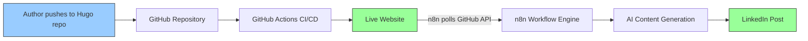
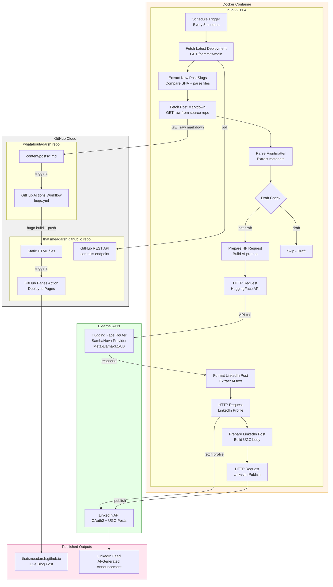
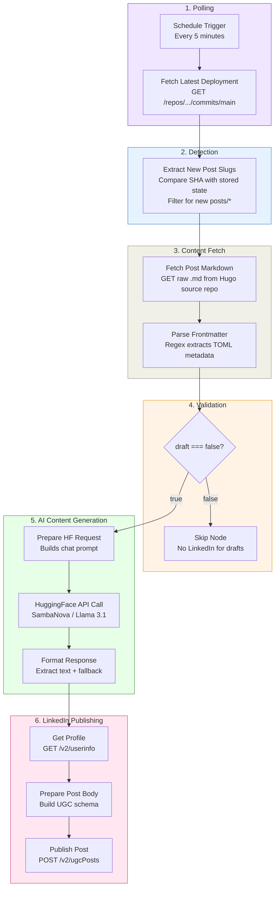
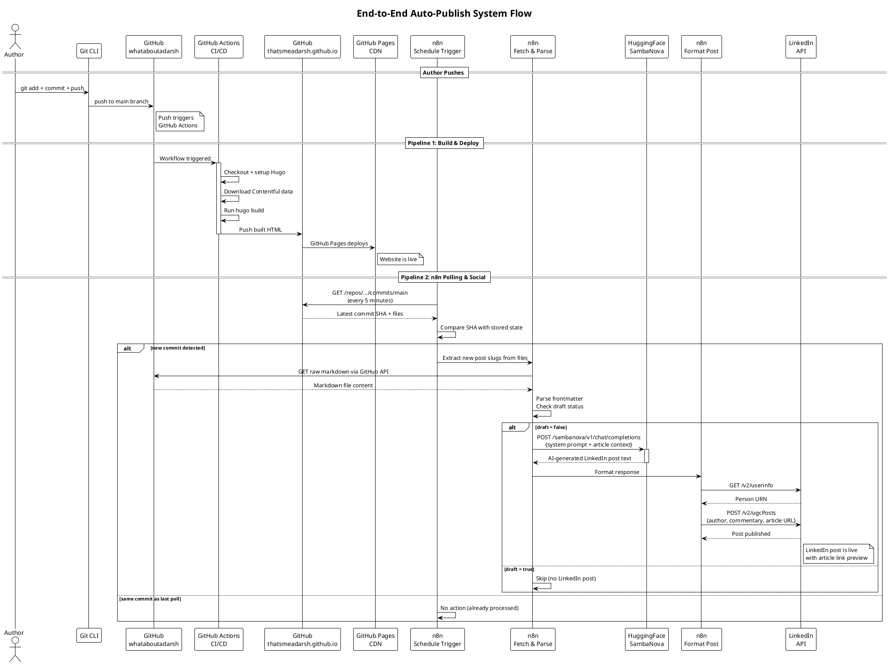
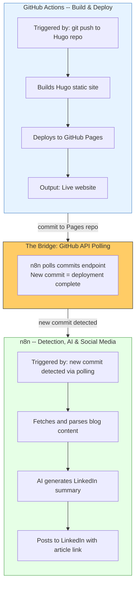
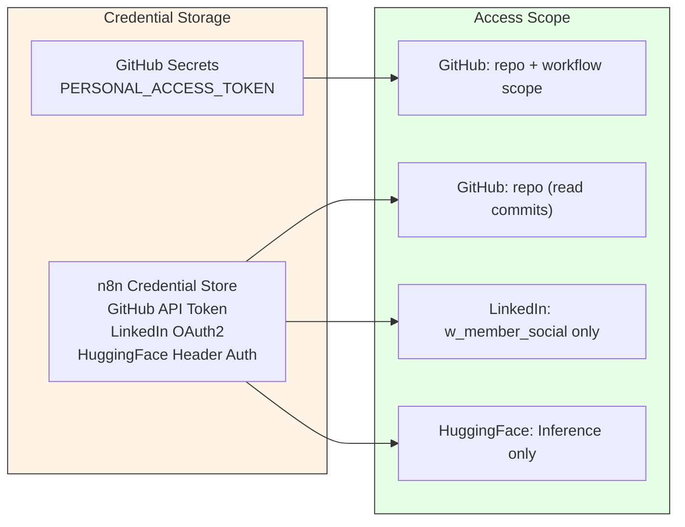

# Architecture Documentation

> A seamless integration of n8n workflow automation with GitHub Actions CI/CD -- turning a single `git push` into a live blog post with an AI-crafted LinkedIn announcement, all without manual intervention.

---

## High-Level Architecture

At a glance, the system transforms a markdown file into a published blog post and LinkedIn announcement through two systems working in sequence:



| Layer | System | Responsibility |
|---|---|---|
| **Build & Deploy** | GitHub Actions | Hugo build, static site deployment |
| **Detection** | n8n polling GitHub API | Detects new commits on the Pages repo every 5 minutes |
| **AI & Social** | n8n + Hugging Face + LinkedIn | Fetch post, AI summary generation, social publishing |

**The key insight**: n8n polls the Pages repo for new commits. A new commit means deployment is complete. n8n then fetches the post content from the source repo, generates an AI summary, and publishes to LinkedIn -- only after the site is live.

---

## High-Level System Flow

```
                    ┌─────────────────────────────────────────────┐
                    │            AUTHOR'S MACHINE                  │
                    │                                              │
                    │   1. Write markdown post                     │
                    │   2. git add + commit + push                 │
                    │                                              │
                    └──────────────────┬───────────────────────────┘
                                       │
                              git push │
                                       │
                    ┌──────────────────▼───────────────────────────┐
                    │          GITHUB CLOUD                         │
                    │                                               │
                    │   ┌─────────────────────┐                     │
                    │   │  GitHub Actions      │                    │
                    │   │  Hugo Build + Deploy │                    │
                    │   └──────────┬──────────┘                     │
                    │              │                                 │
                    │     push to Pages repo                        │
                    │              │                                 │
                    │   ┌──────────▼──────────┐                     │
                    │   │  GitHub Pages        │──── Website Live    │
                    │   └─────────────────────┘                     │
                    │                                               │
                    └───────────────────────────────────────────────┘
                                       ▲
                            polls every │ 5 min
                                       │
                    ┌──────────────────┴────────────────────────────┐
                    │          n8n (Docker)                          │
                    │                                               │
                    │   Poll GitHub API → Detect new commit         │
                    │   → Fetch markdown → AI summary               │
                    │   → LinkedIn publish                          │
                    │                                               │
                    └──────────────────┬────────────────────────────┘
                                       │
                    ┌──────────────────▼──────────┐
                    │     LinkedIn Feed            │
                    │     (AI-Generated Post)      │
                    └─────────────────────────────┘
```

---

## Low-Level Architecture

### Complete System Component Diagram



---

### Low-Level: GitHub Actions Pipeline

The `whataboutadarsh` repo contains a GitHub Actions workflow that triggers on every push to `main`. This is the **build and deploy** engine.


**Key Details**:

| Step | Action | Purpose |
|---|---|---|
| Checkout | `actions/checkout@v3` with submodules | Fetches Hugo theme as git submodule |
| Contentful | `curl` to Contentful CDN | Downloads latest services data for the Services page |
| Hugo Build | `hugo` command | Compiles markdown + Ananke theme into static HTML |
| Cross-Repo Push | `git push` with PAT | Pushes built HTML to the GitHub Pages repository |
| Authentication | `PERSONAL_ACCESS_TOKEN` secret | Enables cross-repository push access |

### Low-Level: n8n Workflow Pipeline

The n8n workflow handles everything after deployment -- polling for changes, fetching content, AI generation, and social media publishing.



---

## System Flow Diagram (PlantUML)



---

## Integration Highlight: n8n + GitHub Actions

> **How we bridged workflow automation with CI/CD to create a zero-touch publishing pipeline**



### Why This Integration Works

| Principle | Implementation |
|---|---|
| **Separation of concerns** | GitHub Actions handles CI/CD. n8n handles detection, AI, and social. |
| **No duplication** | Build and deploy happen only in GitHub Actions. AI and social happen only in n8n. |
| **Deployment guarantee** | n8n only fires after a new commit appears on the Pages repo, meaning deployment is complete. |
| **No host dependencies** | No file watcher, no tunnels, no background processes. Just `git push` and Docker. |
| **Fault isolation** | If LinkedIn posting fails, the website is still live. If GitHub Actions fails, n8n sees no new commit. |
| **Zero manual steps** | From pushing a markdown file to a live website + LinkedIn announcement -- no human intervention. |
| **Corporate-friendly** | Polling uses outbound HTTPS only -- works behind corporate proxies and firewalls. |

---

## Security Architecture



| Secret | Location | Scope | Expiry |
|---|---|---|---|
| GitHub PAT (Actions) | GitHub repo secret (`PERSONAL_ACCESS_TOKEN`) | `repo` + `workflow` | Configurable (90 days recommended) |
| GitHub PAT (n8n) | n8n credential store | `repo` (read access for commits + raw files) | Configurable |
| HuggingFace token | n8n credential store | Inference Providers only | No expiry |
| LinkedIn OAuth2 | n8n credential store (encrypted) | `w_member_social` | 2 months (auto-refreshed by n8n) |

### Security Boundaries

- **n8n** runs in Docker locally -- no public exposure needed
- **All connections are outbound** -- no inbound ports, no tunnels, corporate-firewall-friendly
- **n8n** runs with `NODE_TLS_REJECT_UNAUTHORIZED=0` (container-scoped, not host)
- **GitHub PAT** is stored in GitHub's encrypted secrets and n8n's encrypted credential store

---

## How Post URLs Are Constructed

A key property of this system is that post URLs are **derived automatically from the deployed file path** -- no configuration or guessing involved.

### The Hugo URL Contract

Hugo's static site generator has a deterministic output structure. Given a source file, the output path (and therefore the live URL) is always predictable:

```
Source repo                          Pages repo                    Live URL
─────────────────────────────────────────────────────────────────────────────
content/posts/{slug}.md    →    posts/{slug}/index.html    →    /posts/{slug}/
```

### How n8n Exploits This

When GitHub Actions pushes the built site to the Pages repo, the commit's `files[]` array lists every file that was added. n8n reads this list and applies a regex to extract the slug:

```
Commit files[]:
  "posts/building-auto-publish/index.html"   ← status: added
  "posts/building-auto-publish/cover.jpg"    ← status: added  (ignored)
  "index.html"                               ← status: modified (ignored)
  "sitemap.xml"                              ← status: modified (ignored)

Regex: /^posts\/([^\/]+)\/index\.html$/
           ↑ only post index files
                    ↑ capture group = slug

Result: slug = "building-auto-publish"
```

Then the URL is assembled:

```
"https://thatsmeadarsh.github.io" + "/posts/" + slug + "/"
= "https://thatsmeadarsh.github.io/posts/building-auto-publish/"
```

### Why This Is Reliable

| Property | Guarantee |
|---|---|
| **Deterministic** | Same source filename always produces the same URL |
| **Source of truth** | URL is derived from the actual deployed file, not a guess |
| **Always accurate** | n8n only fires after the Pages repo receives the commit, so the URL is already live |
| **No configuration** | No URL mapping needed -- the file path IS the URL path |

### Example End-to-End

```
Author writes:  content/posts/building-n8n-auto-publish.md
                         │
                         ▼
Hugo builds:    posts/building-n8n-auto-publish/index.html
                         │
                         ▼
Pages repo commit files[]:
  "posts/building-n8n-auto-publish/index.html"  ← added
                         │
                         ▼
n8n extracts slug:  "building-n8n-auto-publish"
                         │
                         ▼
Post URL:  "https://thatsmeadarsh.github.io/posts/building-n8n-auto-publish/"
                         │
                         ▼
LinkedIn scheduled post includes article link:
  originalUrl: "https://thatsmeadarsh.github.io/posts/building-n8n-auto-publish/"
```

---

## LinkedIn Scheduled Post & Review Flow

Rather than publishing immediately, the workflow creates a **scheduled post** set 24 hours in the future. This gives the author a review window.

```
n8n creates scheduled post (lifecycleState: SCHEDULED)
              │
              ▼
LinkedIn: Post queued for T+24h
              │
              │  Author reviews in LinkedIn UI:
              │  Me → Posts & Activity → Scheduled
              │
    ┌─────────┴──────────────┐
    │                        │
    ▼                        ▼
 Happy with it?         Needs edits?
    │                        │
    ▼                        ▼
"Post now"            Edit text → "Post now"
    │                   or wait for auto-publish
    ▼
LinkedIn post goes live with article link preview
```

**The article link card** (title + description + thumbnail) is automatically generated by LinkedIn when it crawls the `originalUrl`. Since the URL is already live when n8n fires, the preview renders correctly.

---

## Design Decisions

| Decision | Rationale |
|---|---|
| **Polling over webhooks** | No tunnel or public URL required. Works behind corporate firewalls. Only outbound HTTPS needed. |
| **5-minute poll interval** | Balances responsiveness with API rate limits. GitHub allows 5000 authenticated requests/hour. |
| **Watch Pages repo, not Hugo repo** | Ensures the website is actually live before announcing on LinkedIn. |
| **Fetch markdown from source repo** | The Pages repo only has built HTML. The source repo has the original markdown with frontmatter for AI context. |
| **Static data for state tracking** | n8n's `$getWorkflowStaticData()` persists the last processed commit SHA between polls. |
| **GitHub Actions for build/deploy** | Already configured and tested; Hugo + cross-repo push is complex to replicate elsewhere |
| **n8n for detection + AI + social** | Keeps n8n focused on what it excels at: API orchestration and conditional logic |
| **HTTP Request nodes over LinkedIn node** | Built-in LinkedIn node doesn't support "Ignore SSL Issues" needed in Docker |
| **Code nodes for JSON construction** | Blog content contains special characters that break inline JSON templates |
| **SambaNova via HuggingFace Router** | Free tier, fast inference, OpenAI-compatible API format |
| **Draft check in n8n** | Allows deploying draft posts to test site rendering without triggering LinkedIn |

---

*Last Updated: 2026-03-14*
*Project: n8n-Powered Auto Web Publish*
