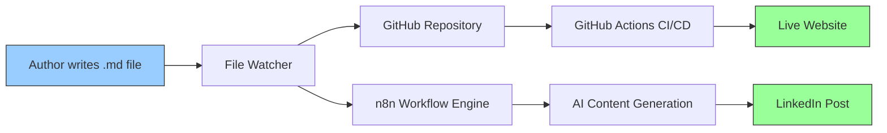
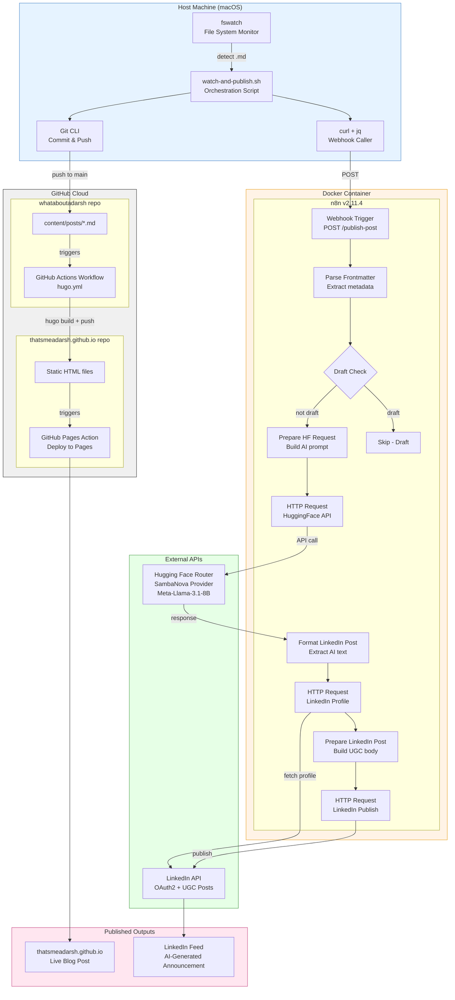
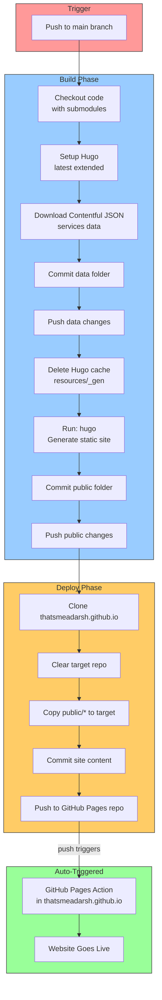
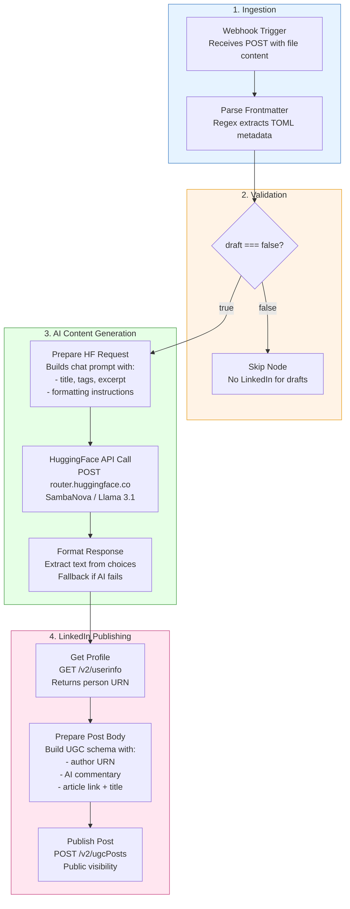
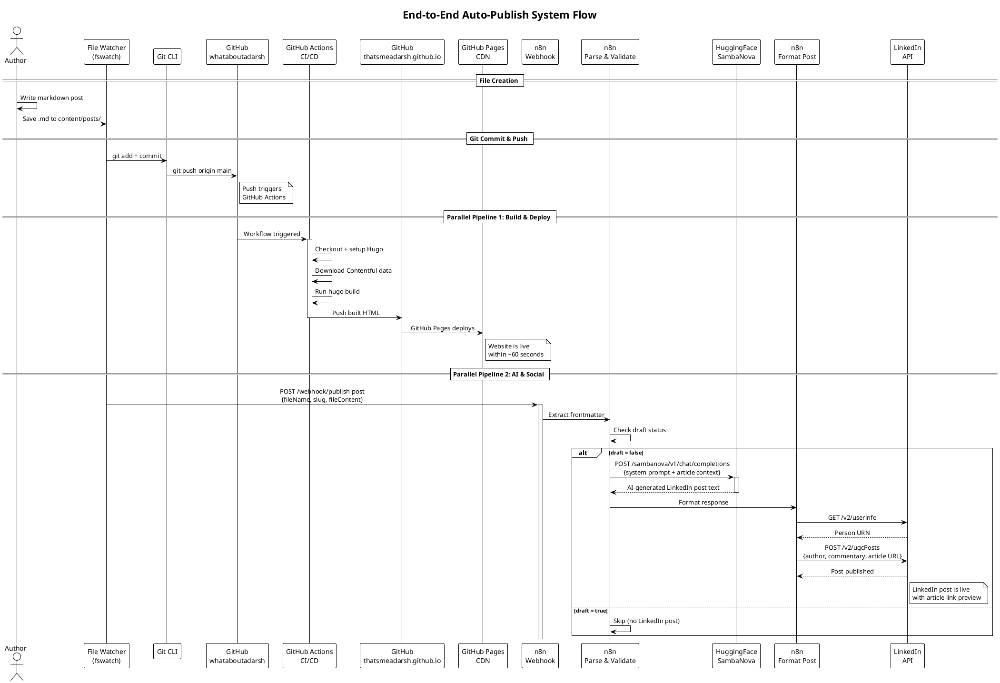
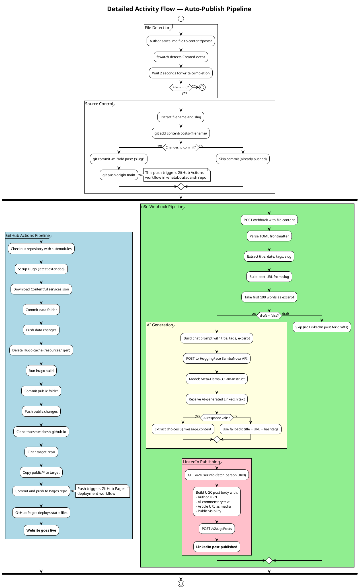
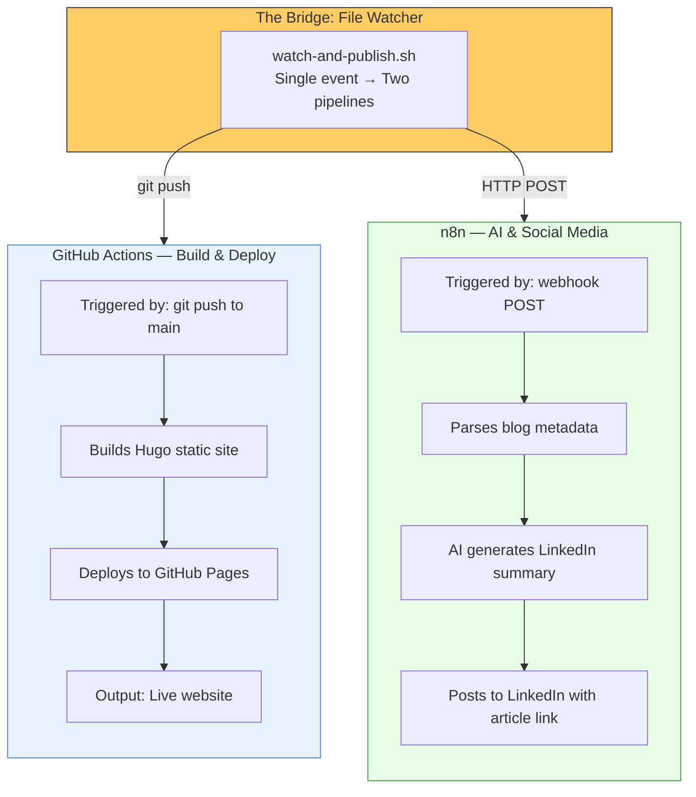
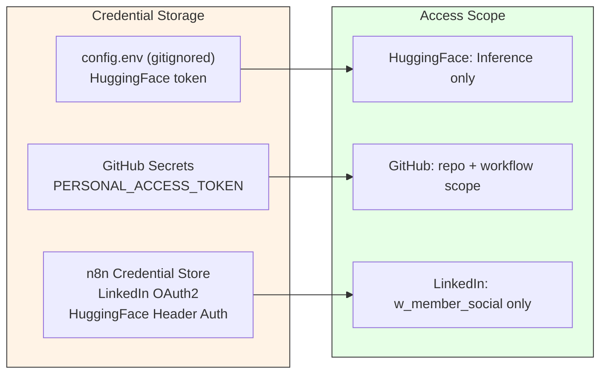

# Architecture Documentation

> A seamless integration of n8n workflow automation with GitHub Actions CI/CD — turning a single markdown file into a live blog post with an AI-crafted LinkedIn announcement, all without manual intervention.

---

## High-Level Architecture

At a glance, the system transforms a markdown file into a published blog post and LinkedIn announcement through three independent systems working in concert:



| Layer | System | Responsibility |
|---|---|---|
| **Detection** | `fswatch` on host | Watches for new blog posts |
| **Build & Deploy** | GitHub Actions | Hugo build, static site deployment |
| **AI & Social** | n8n + Hugging Face + LinkedIn | AI summary generation, social publishing |

**The key insight**: The file watcher acts as an **event bridge** — a single file creation triggers two parallel pipelines (GitHub Actions for deployment, n8n for social promotion) that work independently but deliver a unified outcome.

---

## High-Level System Flow

```
┌─────────────────────────────────────────────────────────────────────┐
│                        AUTHOR'S MACHINE                             │
│                                                                     │
│   1. Write markdown post                                            │
│   2. Save to content/posts/                                         │
│                     │                                               │
│                     ▼                                               │
│            ┌─────────────────┐                                      │
│            │  File Watcher   │                                      │
│            │  (fswatch)      │                                      │
│            └────┬───────┬────┘                                      │
│                 │       │                                           │
│        git push │       │ webhook POST                              │
│                 │       │                                           │
└─────────────────┼───────┼───────────────────────────────────────────┘
                  │       │
         ┌────────┘       └────────┐
         ▼                         ▼
┌─────────────────┐     ┌──────────────────┐
│  GitHub Actions  │     │  n8n (Docker)    │
│  ─────────────── │     │  ──────────────  │
│  Hugo Build      │     │  AI Summary      │
│  Deploy to Pages │     │  LinkedIn Post   │
└────────┬────────┘     └────────┬─────────┘
         │                       │
         ▼                       ▼
┌─────────────────┐     ┌──────────────────┐
│  Live Website    │     │  LinkedIn Feed   │
│  (GitHub Pages)  │     │  (Public Post)   │
└─────────────────┘     └──────────────────┘
```

---

## Low-Level Architecture

### Complete System Component Diagram



---

### Low-Level: GitHub Actions Pipeline

The `whataboutadarsh` repo contains a GitHub Actions workflow that triggers on every push to `main`. This is the **build and deploy** engine.



**Key Details**:

| Step | Action | Purpose |
|---|---|---|
| Checkout | `actions/checkout@v3` with submodules | Fetches Hugo theme as git submodule |
| Contentful | `curl` to Contentful CDN | Downloads latest services data for the Services page |
| Hugo Build | `hugo` command | Compiles markdown + Ananke theme → static HTML |
| Cross-Repo Push | `git push` with PAT | Pushes built HTML to the GitHub Pages repository |
| Authentication | `PERSONAL_ACCESS_TOKEN` secret | Enables cross-repository push access |

### Low-Level: n8n Workflow Pipeline

The n8n workflow handles everything GitHub Actions cannot — AI content generation and social media publishing.



---

## System Flow Diagram (PlantUML)



---

## Detailed Activity Diagram (PlantUML)



---

## Integration Highlight: n8n + GitHub Actions

> **How we bridged workflow automation with CI/CD to create a zero-touch publishing pipeline**

The power of this architecture lies in how **n8n and GitHub Actions complement each other** without overlap or duplication:



### Why This Integration Works

| Principle | Implementation |
|---|---|
| **Separation of concerns** | GitHub Actions handles what it's best at (CI/CD, building, deploying). n8n handles what it's best at (API orchestration, AI integration, conditional logic). |
| **No duplication** | Build and deploy happen only in GitHub Actions. AI and social happen only in n8n. Neither system repeats the other's work. |
| **Event-driven** | A single file creation event fans out into two independent pipelines through the watcher script acting as an event bridge. |
| **Fault isolation** | If LinkedIn posting fails, the website still deploys. If GitHub Actions fails, the LinkedIn post still goes out (with the correct future URL). |
| **Zero manual steps** | From saving a markdown file to a live website + LinkedIn announcement — no human intervention required. |

### The Integration Pattern

```
                    ┌─────────────────┐
                    │  Single Event   │
                    │  (new .md file) │
                    └────────┬────────┘
                             │
                    ┌────────┴────────┐
                    │  Event Bridge   │
                    │  (watcher.sh)   │
                    └───┬─────────┬───┘
                        │         │
              ┌─────────┘         └─────────┐
              │                             │
    ┌─────────▼─────────┐       ┌───────────▼───────────┐
    │   git push         │       │   webhook POST        │
    │   (synchronous)    │       │   (asynchronous)      │
    └─────────┬─────────┘       └───────────┬───────────┘
              │                             │
    ┌─────────▼─────────┐       ┌───────────▼───────────┐
    │  GitHub Actions    │       │  n8n Workflow          │
    │  ───────────────── │       │  ──────────────────    │
    │  Hugo build        │       │  Parse frontmatter     │
    │  Contentful sync   │       │  Draft validation      │
    │  Cross-repo deploy │       │  AI text generation    │
    │                    │       │  LinkedIn publishing   │
    └─────────┬─────────┘       └───────────┬───────────┘
              │                             │
    ┌─────────▼─────────┐       ┌───────────▼───────────┐
    │  LIVE WEBSITE      │       │  LINKEDIN POST        │
    │  thatsmeadarsh     │       │  AI-crafted summary   │
    │  .github.io        │       │  with article link    │
    └───────────────────┘       └───────────────────────┘
```

This pattern is **reusable** — the same event-bridge approach can integrate any CI/CD pipeline with any workflow automation tool, enabling scenarios like:
- Auto-posting to Twitter/X, Mastodon, or other platforms
- Sending email newsletters for new posts
- Triggering SEO indexing via Google Search Console API
- Cross-posting to Medium or Dev.to

---

## Security Architecture



| Secret | Location | Scope | Expiry |
|---|---|---|---|
| HuggingFace token | `config.env` + n8n credential store | Inference Providers only | No expiry |
| GitHub PAT | GitHub repo secret (`PERSONAL_ACCESS_TOKEN`) | `repo` + `workflow` | Configurable (90 days recommended) |
| LinkedIn OAuth2 | n8n credential store (encrypted) | `w_member_social` | 2 months (auto-refreshed by n8n) |

### Security Boundaries

- **Webhook endpoint** is `localhost:5678` only — not exposed to internet
- **n8n** runs in Docker with `NODE_TLS_REJECT_UNAUTHORIZED=0` (container-scoped, not host)
- **GitHub PAT** is stored in GitHub's encrypted secrets, never in code
- **config.env** is gitignored — never committed to version control

---

## Design Decisions

| Decision | Rationale |
|---|---|
| **Watcher on host, not in n8n** | n8n runs in Docker without host filesystem access; `fswatch` on the host is the simplest file detection mechanism |
| **GitHub Actions for build/deploy** | Already configured and tested; Hugo + cross-repo push is complex to replicate elsewhere |
| **n8n for AI + social only** | Keeps n8n focused on what it excels at: API orchestration and conditional logic |
| **HTTP Request nodes over LinkedIn node** | Built-in LinkedIn node doesn't support "Ignore SSL Issues" needed in Docker |
| **Code nodes for JSON construction** | Blog content contains special characters that break inline JSON templates |
| **SambaNova via HuggingFace Router** | Free tier, fast inference, OpenAI-compatible API format |
| **Draft check in n8n** | Allows deploying draft posts to test site rendering without triggering LinkedIn |

---

*Last Updated: 2026-03-14*
*Project: n8n-Powered Auto Web Publish*
