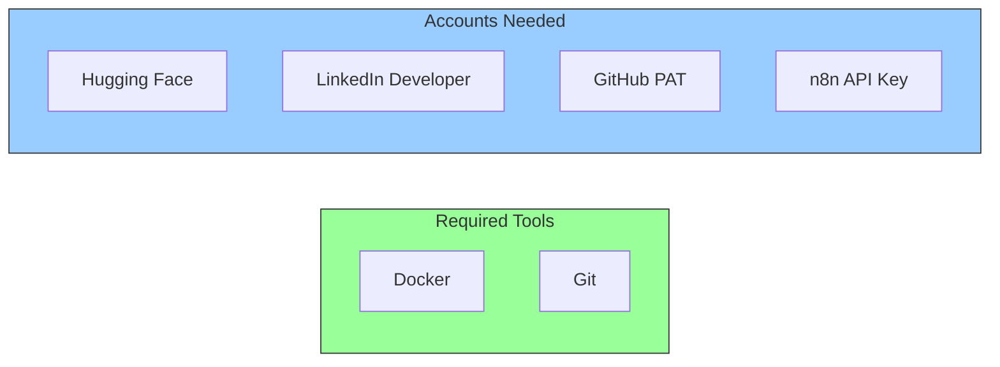
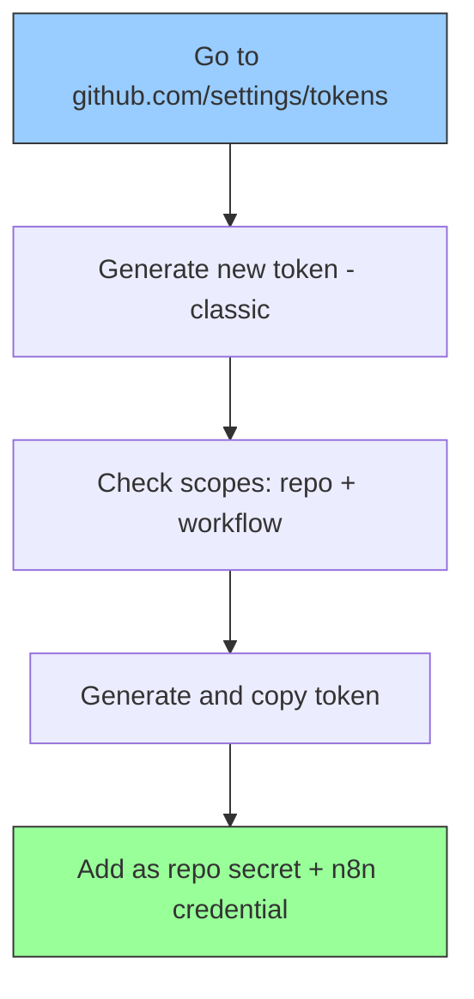

# Setup Guide

> Complete step-by-step guide to set up the automated blog publishing pipeline from scratch.

---

## Prerequisites

Before starting, ensure you have:

- **Docker Desktop** installed and running
- **Git** configured with push access to your Hugo repository
- **GitHub Actions** configured in your Hugo repo for build + deploy
- A **Hugging Face** account
- A **LinkedIn** account



---

## Step 1: Set Up n8n in Docker

### Start n8n

```bash
docker run -d --name n8n --restart unless-stopped \
  -p 5678:5678 \
  -v n8n_data:/home/node/.n8n \
  -e NODE_TLS_REJECT_UNAUTHORIZED=0 \
  docker.n8n.io/n8nio/n8n
```

### Verify n8n is Running

```bash
curl -s http://localhost:5678/healthz
# Expected: {"status":"ok"}
```

Open `http://localhost:5678` in your browser. On first launch, create your n8n account.

### Common Docker Commands

| Command | Purpose |
|---|---|
| `docker stop n8n` | Stop n8n |
| `docker start n8n` | Start n8n |
| `docker logs n8n` | View n8n logs |
| `docker restart n8n` | Restart n8n |

### Why `NODE_TLS_REJECT_UNAUTHORIZED=0`?

The Docker container may not trust SSL certificates in corporate/proxy environments. This flag disables SSL verification for outbound HTTPS calls from n8n. This is **only applied inside the Docker container**, not your host machine.

---

## Step 2: Create GitHub Personal Access Token

You need a PAT for two purposes:
- **GitHub Actions**: cross-repo push from Hugo repo to Pages repo
- **n8n**: reading commits and fetching file content from GitHub API

You can use the same token for both.



1. Go to [github.com/settings/tokens](https://github.com/settings/tokens)
2. Click **"Generate new token (classic)"**
3. **Note**: `n8n-auto-publish`
4. **Expiration**: 90 days or no expiration
5. **Scopes**: Check `repo` and `workflow`
6. Click **Generate token** and copy the `ghp_...` value

Then add it to your Hugo repo:
1. Go to your Hugo repo > **Settings** > **Secrets and variables** > **Actions**
2. Click **"New repository secret"**
3. Name: `PERSONAL_ACCESS_TOKEN`, Value: the `ghp_...` token

---

## Step 3: Create Hugging Face API Token

1. Go to [huggingface.co/settings/tokens](https://huggingface.co/settings/tokens)
2. Click **"Create token"** > Select **"Fine-grained"**
3. Name: `n8n-linkedin-publisher`
4. Under **Inference**, check **"Make calls to Inference Providers"**
5. Leave all other permissions unchecked
6. Click **Create token** and copy the `hf_...` value

---

## Step 4: Set Up n8n Credentials

### 4a: GitHub API

1. Open n8n at `http://localhost:5678`
2. Go to **Overview** > **Credentials** > **Add Credential**
3. Search for **"GitHub API"**
4. Fill in:
   - **Github Server**: `https://api.github.com` (default)
   - **User**: your GitHub username (e.g., `thatsmeadarsh`)
   - **Access Token**: your `ghp_...` token
5. Click **Save**

### 4b: Hugging Face Header Auth

1. Go to **Overview** > **Credentials** > **Add Credential**
2. Search for **"Header Auth"**
3. Fill in:
   - **Name**: `Authorization`
   - **Value**: `Bearer hf_your_token_here`
4. Save as **"HuggingFace API"**

### 4c: LinkedIn OAuth2

#### Create LinkedIn Developer App

1. **Create a LinkedIn Company Page** (required):
   - Go to [linkedin.com/company/setup/new](https://www.linkedin.com/company/setup/new/)
   - Type: **Company**, Name: anything, Industry: Technology, Size: 0-1

2. **Create a LinkedIn App**:
   - Go to [linkedin.com/developers/apps](https://www.linkedin.com/developers/apps)
   - Click **"Create App"**, associate with your company page

3. **Request API Products**:
   - Go to **Products** tab > Request **"Share on LinkedIn"** (grants `w_member_social`)

4. **Configure Auth**:
   - Go to **Auth** tab
   - Add redirect URL: `http://localhost:5678/rest/oauth2-credential/callback`
   - Note your **Client ID** and **Client Secret**

#### Configure in n8n

1. Import the workflow first (Step 5)
2. Open any LinkedIn HTTP Request node > click credential dropdown > **"Create New Credential"**
3. Select **"LinkedIn OAuth2 API"**
4. Fill in Client ID and Client Secret
5. **Turn OFF** both toggles:
   - Organization Support: **OFF**
   - Legacy: **OFF**
6. Click **"Connect my account"** and authorize

### 4d: n8n Internal API Key

WF2 uses the n8n REST API to read and update WF1's draft queue. This requires an API key.

1. Open n8n at `http://localhost:5678`
2. Go to **Settings** (gear icon) > **n8n API**
3. Click **"Create an API Key"**
4. Copy the generated API key
5. Go to **Overview** > **Credentials** > **Add Credential**
6. Search for **"Header Auth"**
7. Fill in:
   - **Name**: `X-N8N-API-KEY`
   - **Value**: your API key
8. Save as **"n8n Internal API"**

---

## Step 5: Import the n8n Workflows

### 5a: Import WF1 — Generate LinkedIn Draft

1. Open n8n at `http://localhost:5678`
2. Go to **Workflows** > **"..."** > **"Import from File"**
3. Select `workflows/auto-publish-workflow.json`
4. Assign credentials:

| Node | Credential |
|---|---|
| Fetch Latest Deployment | GitHub API |
| AI Generate LinkedIn Post | HuggingFace API (Header Auth) |

5. Enable **"Ignore SSL Issues"** on all HTTP Request nodes
6. Click **Publish** and **Activate**

### 5b: Import WF2 — Review & Publish to LinkedIn

1. Go to **Workflows** > **"..."** > **"Import from File"**
2. Select `workflows/review-and-publish-workflow.json`
3. Assign credentials:

| Node | Credential |
|---|---|
| Fetch Draft from WF1 | n8n Internal API (Header Auth) |
| Fetch Draft for Cleanup | n8n Internal API (Header Auth) |
| Remove Draft from Queue | n8n Internal API (Header Auth) |
| Get LinkedIn Profile | LinkedIn OAuth2 |
| Post to LinkedIn | LinkedIn OAuth2 |

4. **Update WF1 ID**: In the "Fetch Draft from WF1", "Fetch Draft for Cleanup", and "Remove Draft from Queue" nodes, update the URL to use your WF1's workflow ID. You can find the ID in the WF1 URL bar (e.g., `http://localhost:5678/workflow/XXXX`).
5. Enable **"Ignore SSL Issues"** on all HTTP Request nodes
6. Click **Publish** and **Activate**

> **Note**: WF1 runs on a 5-minute schedule. On first activation, it stores the current commit SHA without processing. WF2 is always active, waiting for form submissions.

> **Form URL**: After activating WF2, the review form is available at:
> `http://localhost:5678/form/linkedin-review-form`

---

## Step 6: Test the Pipeline

### Test with a Draft Post (safe -- no LinkedIn)

```bash
cd /path/to/hugo-project

cat > content/posts/test-pipeline.md << 'EOF'
+++
title = 'Test Pipeline Post'
date = 2026-01-01T00:00:00+00:00
draft = true
tags = ['test']
+++

Testing the auto-publish pipeline.
EOF

git add content/posts/test-pipeline.md
git commit -m "Add post: test-pipeline"
git push origin main
```

**Expected results**:
- GitHub Actions builds and deploys
- Within 5 minutes, n8n detects the new commit
- n8n fetches the markdown, parses it, detects `draft = true`, skips LinkedIn

### Test with a Real Post (publishes to LinkedIn)

Change `draft = true` to `draft = false` and push a new post. The flow:

1. GitHub Actions builds and deploys the site (~1-3 minutes)
2. Within 5 minutes, n8n WF1 detects the new commit
3. WF1 generates the AI LinkedIn draft and saves it to the draft queue
4. Open the review form: `http://localhost:5678/form/linkedin-review-form`
5. Click **"Load Latest Draft"** on page 1
6. Page 2 shows the pre-filled draft: title, post URL, and AI-generated LinkedIn text
7. Edit the LinkedIn text if needed
8. Select **Approve** or **Reject** and submit
9. On approve: WF2 publishes to LinkedIn immediately
10. On reject: draft is removed from the queue without publishing

**Editing the AI-generated post before approving**: The review form pre-fills the LinkedIn text in an editable field. Make any changes directly in the form before submitting your approval.

### Test n8n Manually

In the n8n workflow editor, click **"Test Workflow"** to run a single poll cycle immediately without waiting for the schedule.

---

## Troubleshooting

| Issue | Solution |
|---|---|
| **n8n not accessible** | `docker ps` to check container; `docker start n8n` |
| **SSL errors in n8n** | Ensure `NODE_TLS_REJECT_UNAUTHORIZED=0` set; restart container |
| **No new posts detected** | Check that Hugo build adds files like `posts/{slug}/index.html` |
| **Post not built (future date)** | Ensure GitHub Actions runs `hugo --buildFuture`; without this flag, future-dated posts are skipped |
| **Markdown fetch fails** | Check source repo is accessible; for private repos, add auth to Fetch node |
| **LinkedIn "unauthorized_scope"** | Turn OFF "Organization Support" and "Legacy" in credential |
| **LinkedIn "unable to sign"** | Re-authorize: open credential > "Connect my account" |
| **LinkedIn 403 on scheduled post** | Do not use `lifecycleState: SCHEDULED` -- requires Marketing Partner access. Use `PUBLISHED` |
| **Form shows empty fields** | WF1 hasn't generated a draft yet. Push a new (non-draft) blog post and wait for WF1 to run. |
| **"No pending drafts" in form** | All drafts have been reviewed. Push a new post to generate a fresh draft. |
| **Queue cleanup fails (405 error)** | Ensure the n8n Internal API credential uses the correct API key and WF1 ID is correct in the URL. |
| **HuggingFace model deprecated** | Use `Meta-Llama-3.1-8B-Instruct` on `sambanova` provider |
| **GitHub Actions fails (Node.js 16)** | Update to `actions/checkout@v4` and `peaceiris/actions-hugo@v3` |
| **GitHub Actions "Commit public folder" fails** | Add `public/` to `.gitignore`; the runner copies `public/*` to Pages repo directly |
| **Git push rejected** | Run `git pull --rebase` in the affected repo |
| **n8n processes same post twice** | Check workflow static data; SHA should update after each run |

---

*Last Updated: 2026-03-15*
*Project: n8n-Powered Auto Web Publish*
