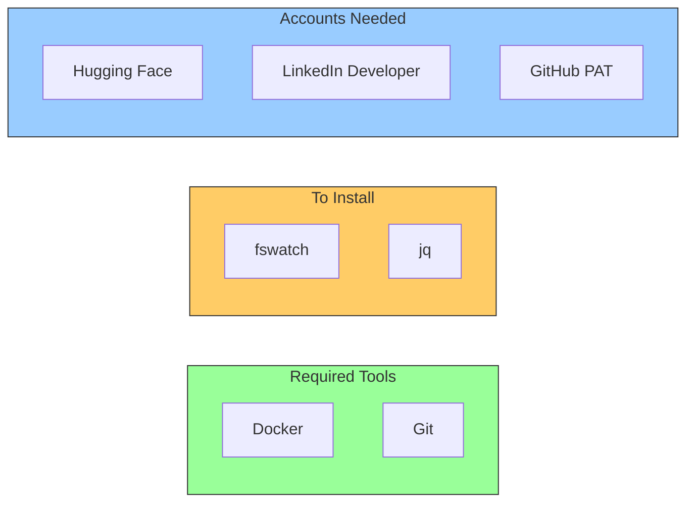
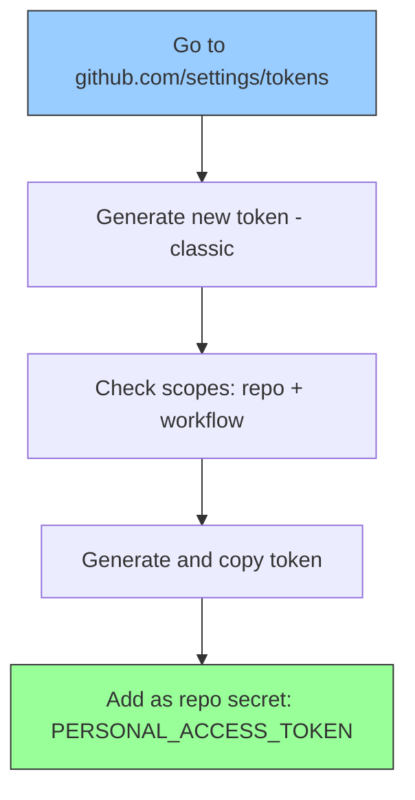

# Setup Guide

> Complete step-by-step guide to set up the automated blog publishing pipeline from scratch.

---

## Prerequisites

Before starting, ensure you have:

- **macOS** (the watcher script uses macOS-compatible tools)
- **Docker Desktop** installed and running
- **Hugo** static site generator with a working project
- **Git** configured with push access to your Hugo repository
- **GitHub Actions** configured in your Hugo repo for build + deploy
- A **Hugging Face** account
- A **LinkedIn** account



---

## Step 1: Install Dependencies

```bash
# Install fswatch (file system watcher)
brew install fswatch

# Install jq (JSON processor)
brew install jq

# Verify all tools
git --version
docker --version
fswatch --version
jq --version
```

---

## Step 2: Set Up n8n in Docker

### Start n8n

```bash
docker run -d --name n8n --restart unless-stopped \
  -p 5678:5678 \
  -v n8n_data:/home/node/.n8n \
  -e NODE_TLS_REJECT_UNAUTHORIZED=0 \
  docker.n8n.io/n8nio/n8n
```

### Verify n8n is Running

```bash
curl -s http://localhost:5678/healthz
# Expected: {"status":"ok"}
```

Open `http://localhost:5678` in your browser. On first launch, create your n8n account.

### Common Docker Commands

| Command | Purpose |
|---|---|
| `docker stop n8n` | Stop n8n |
| `docker start n8n` | Start n8n |
| `docker logs n8n` | View n8n logs |
| `docker restart n8n` | Restart n8n |

### Why `NODE_TLS_REJECT_UNAUTHORIZED=0`?

The Docker container may not trust SSL certificates in corporate/proxy environments. This flag disables SSL verification for outbound HTTPS calls from n8n. This is **only applied inside the Docker container**, not your host machine.

---

## Step 3: Create GitHub Personal Access Token

The Hugo repo's GitHub Actions workflow needs a PAT to push built files to the GitHub Pages repo.



1. Go to [github.com/settings/tokens](https://github.com/settings/tokens)
2. Click **"Generate new token (classic)"**
3. **Note**: `n8n-auto-publish`
4. **Expiration**: 90 days or no expiration
5. **Scopes**: Check `repo` and `workflow`
6. Click **Generate token** and copy the `ghp_...` value

Then add it to your Hugo repo:
1. Go to your Hugo repo → **Settings** → **Secrets and variables** → **Actions**
2. Click **"New repository secret"**
3. Name: `PERSONAL_ACCESS_TOKEN`, Value: the `ghp_...` token

---

## Step 4: Configure the Project

### Clone the Repository

```bash
git clone https://github.com/thatsmeadarsh/n8n-powered-auto-web-publish.git
cd n8n-powered-auto-web-publish
```

### Create Your Configuration

```bash
cp config.sample.env config.env
```

Edit `config.env` with your values:

```bash
# --- Hugo Project ---
HUGO_DIR="/path/to/your/hugo-project"
POSTS_DIR="${HUGO_DIR}/content/posts"

# --- n8n Webhook ---
WEBHOOK_URL="http://localhost:5678/webhook/publish-post"

# --- Logging ---
LOG_DIR="/path/to/n8n-powered-auto-web-publish/logs"

# --- Site URL ---
SITE_BASE_URL="https://yourusername.github.io"

# --- Hugging Face ---
HF_API_TOKEN="hf_your_token_here"
HF_MODEL_ID="Meta-Llama-3.1-8B-Instruct"
```

> **Note**: `config.env` is gitignored and will never be committed.

---

## Step 5: Create Hugging Face API Token

1. Go to [huggingface.co/settings/tokens](https://huggingface.co/settings/tokens)
2. Click **"Create token"** → Select **"Fine-grained"**
3. Name: `n8n-linkedin-publisher`
4. Under **Inference**, check **"Make calls to Inference Providers"**
5. Leave all other permissions unchecked
6. Click **Create token** and copy the `hf_...` value

---

## Step 6: Set Up n8n Credentials

### 6a: Hugging Face Header Auth

1. Open n8n at `http://localhost:5678`
2. Go to **Overview** > **Credentials** > **Add Credential**
3. Search for **"Header Auth"**
4. Fill in:
   - **Name**: `Authorization`
   - **Value**: `Bearer hf_your_token_here`
5. Click **Save**

### 6b: LinkedIn OAuth2

#### Create LinkedIn Developer App

1. **Create a LinkedIn Company Page** (required):
   - Go to [linkedin.com/company/setup/new](https://www.linkedin.com/company/setup/new/)
   - Type: **Company**, Name: anything, Industry: Technology, Size: 0-1

2. **Create a LinkedIn App**:
   - Go to [linkedin.com/developers/apps](https://www.linkedin.com/developers/apps)
   - Click **"Create App"**, associate with your company page

3. **Request API Products**:
   - Go to **Products** tab → Request **"Share on LinkedIn"** (grants `w_member_social`)

4. **Configure Auth**:
   - Go to **Auth** tab
   - Add redirect URL: `http://localhost:5678/rest/oauth2-credential/callback`
   - Note your **Client ID** and **Client Secret**

#### Configure in n8n

1. Import the workflow first (Step 7)
2. Open any LinkedIn HTTP Request node → click credential dropdown → **"Create New Credential"**
3. Select **"LinkedIn OAuth2 API"**
4. Fill in Client ID and Client Secret
5. **Turn OFF** both toggles:
   - Organization Support: **OFF**
   - Legacy: **OFF**
6. Click **"Connect my account"** and authorize

---

## Step 7: Import the n8n Workflow

1. Open n8n at `http://localhost:5678`
2. Go to **Workflows** → **"..."** → **"Import from File"**
3. Select `workflows/auto-publish-workflow.json`
4. Assign credentials:

| Node | Credential |
|---|---|
| AI Generate LinkedIn Post | Header Auth (HuggingFace) |
| Get LinkedIn Profile | LinkedIn OAuth2 |
| Post to LinkedIn | LinkedIn OAuth2 |

5. Enable **"Ignore SSL Issues"** on all three HTTP Request nodes
6. Click **Publish**

---

## Step 8: Start the File Watcher

```bash
cd /path/to/n8n-powered-auto-web-publish

# Run in foreground (for testing)
./scripts/watch-and-publish.sh

# Run in background
nohup ./scripts/watch-and-publish.sh > /dev/null 2>&1 &

# Check logs
tail -f logs/watcher.log
```

---

## Step 9: Test the Pipeline

### Test with a Draft Post (safe — no LinkedIn)

```bash
cat > /path/to/hugo-project/content/posts/test-pipeline.md << 'EOF'
+++
title = 'Test Pipeline Post'
date = 2026-01-01T00:00:00+00:00
draft = true
tags = ['test']
+++

Testing the auto-publish pipeline.
EOF
```

**Expected results**:
- Watcher commits and pushes to Hugo repo
- GitHub Actions builds and deploys (draft won't appear on site)
- n8n receives webhook, parses, detects `draft = true`, skips LinkedIn

### Test with a Real Post (publishes to LinkedIn)

Change `draft = true` to `draft = false` and save a new file. Verify:
1. Post appears on your website
2. LinkedIn post shows up on your profile

### Test Webhook Only (skip watcher)

```bash
CONTENT=$(cat /path/to/hugo-project/content/posts/existing-post.md)
curl -s -X POST "http://localhost:5678/webhook/publish-post" \
  -H "Content-Type: application/json" \
  -d "$(jq -n \
    --arg fileName "test.md" \
    --arg slug "test" \
    --arg content "$CONTENT" \
    --arg siteUrl "https://yourusername.github.io" \
    '{fileName: $fileName, slug: $slug, fileContent: $content, siteBaseUrl: $siteUrl}')"
```

---

## Troubleshooting

| Issue | Solution |
|---|---|
| **n8n not accessible** | `docker ps` to check container; `docker start n8n` |
| **SSL errors in n8n** | Ensure `NODE_TLS_REJECT_UNAUTHORIZED=0` set; restart container |
| **LinkedIn "unauthorized_scope"** | Turn OFF "Organization Support" and "Legacy" in credential |
| **LinkedIn "unable to sign"** | Re-authorize: open credential → "Connect my account" |
| **HuggingFace model deprecated** | Use `Meta-Llama-3.1-8B-Instruct` on `sambanova` provider |
| **Webhook returns 404** | Workflow not published; click "Publish" in n8n |
| **Watcher not detecting files** | Verify `fswatch` installed; check path in `config.env` |
| **GitHub Actions fails** | Check `PERSONAL_ACCESS_TOKEN` hasn't expired |
| **Git push rejected** | Run `git pull --rebase` in the affected repo |

---

*Last Updated: 2026-03-14*
*Project: n8n-Powered Auto Web Publish*
