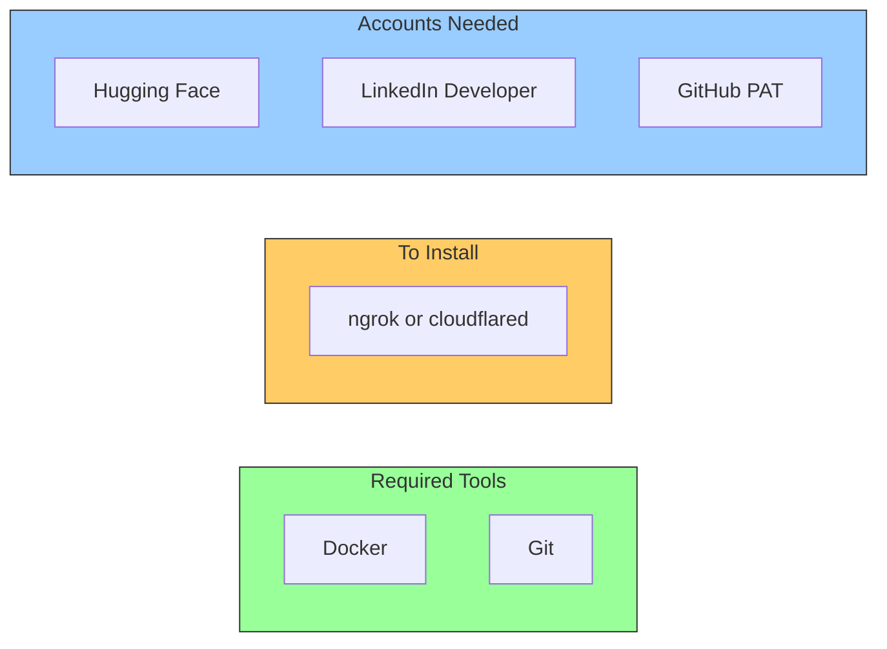
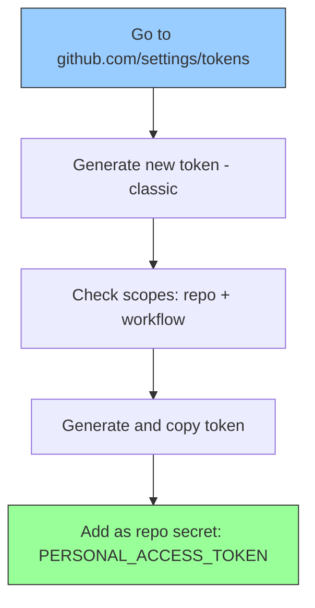

# Setup Guide

> Complete step-by-step guide to set up the automated blog publishing pipeline from scratch.

---

## Prerequisites

Before starting, ensure you have:

- **Docker Desktop** installed and running
- **Git** configured with push access to your Hugo repository
- **GitHub Actions** configured in your Hugo repo for build + deploy
- A **Hugging Face** account
- A **LinkedIn** account
- A tunnel tool (**ngrok** or **Cloudflare Tunnel**) for exposing n8n to GitHub webhooks



---

## Step 1: Install Dependencies

```bash
# Install ngrok (for tunneling GitHub webhooks to local n8n)
brew install ngrok

# Verify tools
git --version
docker --version
ngrok version
```

---

## Step 2: Set Up n8n in Docker

### Start n8n

```bash
docker run -d --name n8n --restart unless-stopped \
  -p 5678:5678 \
  -v n8n_data:/home/node/.n8n \
  -e NODE_TLS_REJECT_UNAUTHORIZED=0 \
  -e WEBHOOK_URL=https://your-tunnel-url.ngrok-free.app \
  docker.n8n.io/n8nio/n8n
```

> **Important**: Set `WEBHOOK_URL` to your tunnel's public URL (from Step 3). You can update this later by recreating the container.

### Verify n8n is Running

```bash
curl -s http://localhost:5678/healthz
# Expected: {"status":"ok"}
```

Open `http://localhost:5678` in your browser. On first launch, create your n8n account.

### Common Docker Commands

| Command | Purpose |
|---|---|
| `docker stop n8n` | Stop n8n |
| `docker start n8n` | Start n8n |
| `docker logs n8n` | View n8n logs |
| `docker restart n8n` | Restart n8n |

### Why `NODE_TLS_REJECT_UNAUTHORIZED=0`?

The Docker container may not trust SSL certificates in corporate/proxy environments. This flag disables SSL verification for outbound HTTPS calls from n8n. This is **only applied inside the Docker container**, not your host machine.

---

## Step 3: Set Up a Tunnel

GitHub webhooks need to reach your local n8n instance. Use a tunnel to expose `localhost:5678` to the internet.

### Option A: ngrok (recommended for development)

```bash
# Start the tunnel
ngrok http 5678

# Note the forwarding URL, e.g.:
# https://abc123.ngrok-free.app -> http://localhost:5678
```

### Option B: Cloudflare Tunnel (recommended for production)

```bash
# Install cloudflared
brew install cloudflared

# Create a tunnel
cloudflared tunnel create n8n-webhook
cloudflared tunnel route dns n8n-webhook n8n.yourdomain.com
cloudflared tunnel run --url http://localhost:5678 n8n-webhook
```

### Update n8n with Tunnel URL

After getting your tunnel URL, update the n8n container:

```bash
docker stop n8n && docker rm n8n

docker run -d --name n8n --restart unless-stopped \
  -p 5678:5678 \
  -v n8n_data:/home/node/.n8n \
  -e NODE_TLS_REJECT_UNAUTHORIZED=0 \
  -e WEBHOOK_URL=https://your-tunnel-url.ngrok-free.app \
  docker.n8n.io/n8nio/n8n
```

The `WEBHOOK_URL` environment variable tells n8n what public URL to use when registering webhooks with external services like GitHub.

---

## Step 4: Create GitHub Personal Access Tokens

You need **two** GitHub PATs -- one for GitHub Actions (cross-repo push) and one for n8n (webhook registration + API access).

### 4a: PAT for GitHub Actions (cross-repo push)



1. Go to [github.com/settings/tokens](https://github.com/settings/tokens)
2. Click **"Generate new token (classic)"**
3. **Note**: `hugo-deploy`
4. **Expiration**: 90 days or no expiration
5. **Scopes**: Check `repo` and `workflow`
6. Click **Generate token** and copy the `ghp_...` value

Then add it to your Hugo repo:
1. Go to your Hugo repo > **Settings** > **Secrets and variables** > **Actions**
2. Click **"New repository secret"**
3. Name: `PERSONAL_ACCESS_TOKEN`, Value: the `ghp_...` token

### 4b: PAT for n8n (webhook + API access)

1. Go to [github.com/settings/tokens](https://github.com/settings/tokens)
2. Click **"Generate new token (classic)"**
3. **Note**: `n8n-webhook-access`
4. **Expiration**: 90 days or no expiration
5. **Scopes**: Check `repo` and `admin:repo_hook`
6. Click **Generate token** and copy the `ghp_...` value

> **Note**: `admin:repo_hook` is required for n8n to automatically register/manage webhooks on your GitHub repos.

---

## Step 5: Create Hugging Face API Token

1. Go to [huggingface.co/settings/tokens](https://huggingface.co/settings/tokens)
2. Click **"Create token"** > Select **"Fine-grained"**
3. Name: `n8n-linkedin-publisher`
4. Under **Inference**, check **"Make calls to Inference Providers"**
5. Leave all other permissions unchecked
6. Click **Create token** and copy the `hf_...` value

---

## Step 6: Set Up n8n Credentials

### 6a: GitHub API Token

1. Open n8n at `http://localhost:5678`
2. Go to **Overview** > **Credentials** > **Add Credential**
3. Search for **"GitHub API"**
4. Fill in:
   - **Access Token**: your `ghp_...` token (from Step 4b)
5. Click **Save**

### 6b: GitHub Raw Auth (Header Auth for fetching markdown)

1. Go to **Overview** > **Credentials** > **Add Credential**
2. Search for **"Header Auth"**
3. Fill in:
   - **Name**: `Authorization`
   - **Value**: `token ghp_your_n8n_token_here`
4. Save as **"GitHub Raw Auth"**

> **Note**: If your Hugo source repo is public, this credential is optional. The Fetch Post Markdown node will work without auth for public repos.

### 6c: Hugging Face Header Auth

1. Go to **Overview** > **Credentials** > **Add Credential**
2. Search for **"Header Auth"**
3. Fill in:
   - **Name**: `Authorization`
   - **Value**: `Bearer hf_your_token_here`
4. Save as **"HuggingFace API"**

### 6d: LinkedIn OAuth2

#### Create LinkedIn Developer App

1. **Create a LinkedIn Company Page** (required):
   - Go to [linkedin.com/company/setup/new](https://www.linkedin.com/company/setup/new/)
   - Type: **Company**, Name: anything, Industry: Technology, Size: 0-1

2. **Create a LinkedIn App**:
   - Go to [linkedin.com/developers/apps](https://www.linkedin.com/developers/apps)
   - Click **"Create App"**, associate with your company page

3. **Request API Products**:
   - Go to **Products** tab > Request **"Share on LinkedIn"** (grants `w_member_social`)

4. **Configure Auth**:
   - Go to **Auth** tab
   - Add redirect URL: `http://localhost:5678/rest/oauth2-credential/callback`
   - Note your **Client ID** and **Client Secret**

#### Configure in n8n

1. Import the workflow first (Step 7)
2. Open any LinkedIn HTTP Request node > click credential dropdown > **"Create New Credential"**
3. Select **"LinkedIn OAuth2 API"**
4. Fill in Client ID and Client Secret
5. **Turn OFF** both toggles:
   - Organization Support: **OFF**
   - Legacy: **OFF**
6. Click **"Connect my account"** and authorize

---

## Step 7: Import the n8n Workflow

1. Open n8n at `http://localhost:5678`
2. Go to **Workflows** > **"..."** > **"Import from File"**
3. Select `workflows/auto-publish-workflow.json`
4. Assign credentials to each node:

| Node | Credential |
|---|---|
| GitHub Push Trigger | GitHub API |
| Fetch Post Markdown | GitHub Raw Auth (Header Auth) |
| AI Generate LinkedIn Post | HuggingFace API (Header Auth) |
| Get LinkedIn Profile | LinkedIn OAuth2 |
| Post to LinkedIn | LinkedIn OAuth2 |

5. Enable **"Ignore SSL Issues"** on the HTTP Request nodes (AI Generate, Get LinkedIn Profile, Post to LinkedIn)
6. Click **Publish**

> **Important**: When you activate the workflow, n8n will automatically register a webhook on the `thatsmeadarsh.github.io` repo via GitHub API. You can verify this in the repo's Settings > Webhooks.

---

## Step 8: Test the Pipeline

### Test with a Draft Post (safe -- no LinkedIn)

```bash
cd /path/to/hugo-project

cat > content/posts/test-pipeline.md << 'EOF'
+++
title = 'Test Pipeline Post'
date = 2026-01-01T00:00:00+00:00
draft = true
tags = ['test']
+++

Testing the auto-publish pipeline.
EOF

git add content/posts/test-pipeline.md
git commit -m "Add post: test-pipeline"
git push origin main
```

**Expected results**:
- GitHub Actions builds and deploys (draft won't appear on site by default)
- Push to Pages repo triggers n8n webhook
- n8n detects the new post, fetches markdown, parses it, detects `draft = true`, skips LinkedIn

### Test with a Real Post (publishes to LinkedIn)

Change `draft = true` to `draft = false` and push a new post. Verify:
1. Post appears on your website
2. LinkedIn post shows up on your profile

### Test n8n Trigger Only (manual)

In the n8n workflow editor:
1. Click the **GitHub Push Trigger** node
2. Click **"Listen for test event"**
3. Push a change to the `thatsmeadarsh.github.io` repo (or wait for GitHub Actions to push)
4. n8n captures the event and runs the workflow in test mode

---

## Troubleshooting

| Issue | Solution |
|---|---|
| **n8n not accessible** | `docker ps` to check container; `docker start n8n` |
| **SSL errors in n8n** | Ensure `NODE_TLS_REJECT_UNAUTHORIZED=0` set; restart container |
| **GitHub webhook not firing** | Check repo Settings > Webhooks; ensure tunnel is running |
| **Webhook URL mismatch** | Set `WEBHOOK_URL` env var in Docker to your tunnel URL |
| **n8n can't register webhook** | Check GitHub PAT has `admin:repo_hook` scope |
| **No new posts detected** | Check that Hugo build adds files like `posts/{slug}/index.html` |
| **Markdown fetch fails** | Check source repo is accessible; for private repos, configure auth |
| **LinkedIn "unauthorized_scope"** | Turn OFF "Organization Support" and "Legacy" in credential |
| **LinkedIn "unable to sign"** | Re-authorize: open credential > "Connect my account" |
| **HuggingFace model deprecated** | Use `Meta-Llama-3.1-8B-Instruct` on `sambanova` provider |
| **GitHub Actions fails** | Check `PERSONAL_ACCESS_TOKEN` hasn't expired |
| **Git push rejected** | Run `git pull --rebase` in the affected repo |

---

*Last Updated: 2026-03-14*
*Project: n8n-Powered Auto Web Publish*
