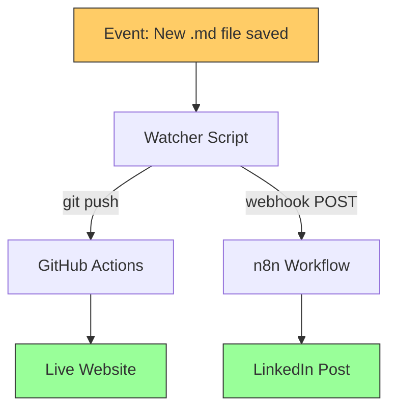
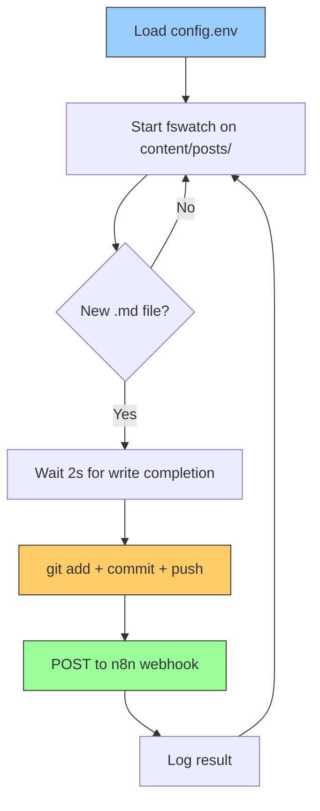
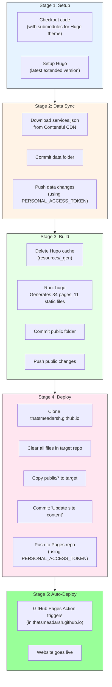
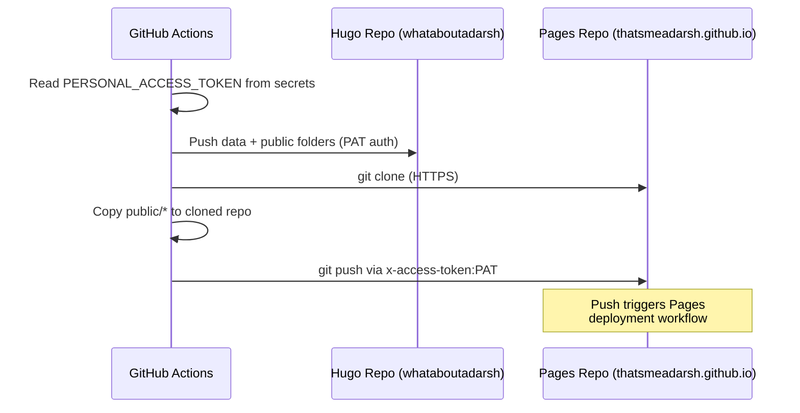
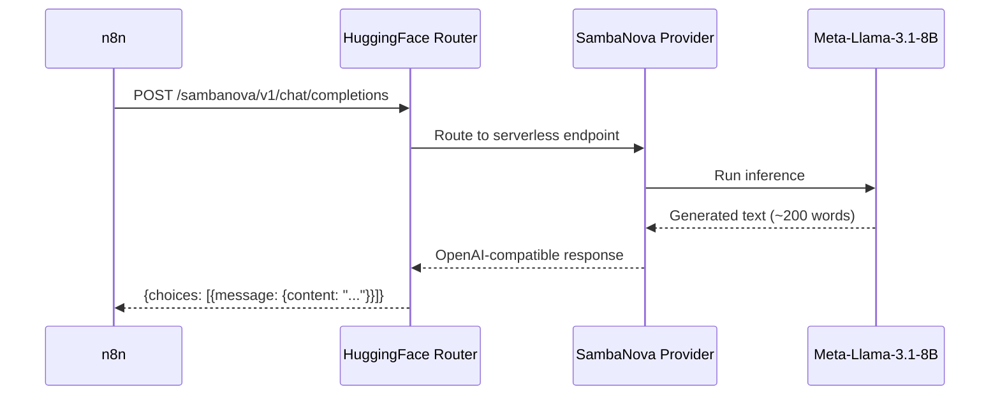
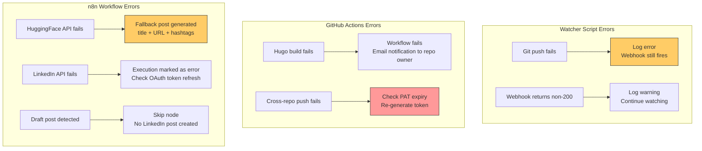

# Workflow Documentation

> Detailed functional documentation of the watcher script, GitHub Actions pipeline, and every node in the n8n workflow — the three systems that power zero-touch blog publishing.

---

## System Overview

The auto-publish pipeline consists of three independent systems triggered by a single event:



---

## Part 1: Watcher Script

**File**: `scripts/watch-and-publish.sh`

The watcher is the simplest component — it detects new files and dispatches events to both pipelines.



### Configuration

All paths and URLs are loaded from `config.env`:

| Variable | Purpose |
|---|---|
| `HUGO_DIR` | Path to the Hugo project (for git operations) |
| `POSTS_DIR` | Path to `content/posts/` (watch target) |
| `WEBHOOK_URL` | n8n webhook endpoint |
| `SITE_BASE_URL` | Website base URL (for constructing post links) |
| `LOG_DIR` | Log file location |

### Webhook Payload

The watcher sends this JSON to n8n:

```json
{
  "fileName": "my-new-post.md",
  "slug": "my-new-post",
  "fileContent": "+++\ntitle = '...'\n+++\n\nFull markdown content...",
  "siteBaseUrl": "https://thatsmeadarsh.github.io"
}
```

---

## Part 2: GitHub Actions Pipeline

**File**: `whataboutadarsh/.github/workflows/hugo.yml`
**Trigger**: Push to `main` branch (triggered by the watcher's `git push`)

This is the **build and deploy** engine. It runs entirely in GitHub's cloud infrastructure.

### Pipeline Stages



### Authentication Flow



### Key Configuration

| Setting | Value | Purpose |
|---|---|---|
| `persist-credentials: false` | Checkout step | Prevents default GITHUB_TOKEN from being used for pushes |
| `PERSONAL_ACCESS_TOKEN` | Repository secret | Enables cross-repository push (Hugo repo → Pages repo) |
| `submodules: true` | Checkout step | Fetches Ananke Hugo theme |
| `fetch-depth: 0` | Checkout step | Full git history for Hugo's `.GitInfo` |

---

## Part 3: n8n Workflow

**File**: `workflows/auto-publish-workflow.json`
**Trigger**: Webhook POST from watcher script
**Total Nodes**: 9 active + 1 no-op

### Workflow Canvas

```
Webhook    Parse       Is Not    Prepare    AI Generate   Format      Get         Prepare     Post to
Trigger → Frontmatter → Draft? → HF Request → LinkedIn → LinkedIn → LinkedIn  → LinkedIn  → LinkedIn
                          │        Post        Post       Profile     Post
                          ▼
                       Skip (Draft)
```

### Node-by-Node Documentation

---

#### Node 1: Webhook Trigger

| Property | Value |
|---|---|
| **Type** | `n8n-nodes-base.webhook` |
| **Method** | POST |
| **Path** | `/webhook/publish-post` |
| **Full URL** | `http://localhost:5678/webhook/publish-post` |
| **Response** | Immediate 200 (async processing) |

Receives the file content and metadata from the watcher script.

---

#### Node 2: Parse Frontmatter

| Property | Value |
|---|---|
| **Type** | `n8n-nodes-base.code` (JavaScript) |
| **Purpose** | Extract structured metadata from Hugo's TOML frontmatter |

**Parsing Logic**:

```mermaid
graph TD
    A[Raw fileContent string] --> B["Regex match: /^\\+\\+\\+([\\s\\S]*?)\\+\\+\\+/"]
    B --> C[TOML block extracted]
    C --> D["title = regex /title\\s*=\\s*['\"](.+?)['\"]/"]
    C --> E["date = regex /date\\s*=\\s*['\"](.+?)['\"]/"]
    C --> F["draft = regex /draft\\s*=\\s*(true|false)/"]
    C --> G["tags = regex /tags\\s*=\\s*\\[([^\\]]+)\\]/"]
    C --> H["categories = similar pattern"]
    A --> I["Body = content after closing +++"]
    I --> J["Excerpt = first 500 words"]

    style A fill:#99ccff,stroke:#333
    style J fill:#99ff99,stroke:#333
```

**Supported Frontmatter Format** (Hugo TOML):
```toml
+++
title = 'My Blog Post Title'
date = 2026-03-14T10:00:00+01:00
draft = false
tags = ['AI', 'MCP', 'Automation']
categories = ['Technology', 'Software Engineering']
+++
```

**Output Schema**:
```json
{
  "title": "My Blog Post Title",
  "date": "2026-03-14T10:00:00+01:00",
  "draft": false,
  "tags": ["AI", "MCP", "Automation"],
  "categories": ["Technology", "Software Engineering"],
  "slug": "my-blog-post",
  "fileName": "my-blog-post.md",
  "postUrl": "https://thatsmeadarsh.github.io/posts/my-blog-post/",
  "excerpt": "First 500 words of the article body..."
}
```

---

#### Node 3: Is Not Draft?

| Property | Value |
|---|---|
| **Type** | `n8n-nodes-base.if` |
| **Condition** | `$json.draft === false` |
| **True** | Continue to AI generation |
| **False** | Skip (no LinkedIn post) |

**Why this matters**: Draft posts are committed and deployed (for preview testing) but don't trigger social media posting. This gives authors the ability to review their post on the live site before promoting it.

---

#### Node 4: Prepare HF Request

| Property | Value |
|---|---|
| **Type** | `n8n-nodes-base.code` (JavaScript) |
| **Purpose** | Build a safe, properly escaped JSON request body |

**Why a separate code node?** Blog content contains quotes, newlines, markdown syntax, HTML, and special characters. Directly interpolating these into the HTTP Request node's JSON template causes parsing errors. This node builds the request programmatically.

**AI Prompt Structure**:
```
System: You are a professional LinkedIn content writer. Write engaging
        posts that drive clicks and engagement.

User:   Write a compelling LinkedIn post (150-200 words) announcing my
        new blog article.

        Title: {extracted title}
        Tags: {extracted tags}
        Article excerpt: {first 800 chars}
        URL: {constructed post URL}

        Requirements:
        - Professional but engaging tone
        - 2-3 relevant hashtags from tags
        - Call to action with article URL
        - Maximum 2-3 emojis
```

---

#### Node 5: AI Generate LinkedIn Post

| Property | Value |
|---|---|
| **Type** | `n8n-nodes-base.httpRequest` |
| **Method** | POST |
| **URL** | `https://router.huggingface.co/sambanova/v1/chat/completions` |
| **Auth** | Header Auth (`Authorization: Bearer hf_...`) |
| **SSL** | Ignore SSL Issues: ON |
| **Timeout** | 30 seconds |



**Model Configuration**:

| Parameter | Value | Rationale |
|---|---|---|
| Model | `Meta-Llama-3.1-8B-Instruct` | Free tier, good instruction-following |
| Provider | SambaNova | Fast serverless inference |
| max_tokens | 400 | Enough for 200-word post |
| temperature | 0.7 | Creative but coherent |

---

#### Node 6: Format LinkedIn Post

| Property | Value |
|---|---|
| **Type** | `n8n-nodes-base.code` (JavaScript) |
| **Purpose** | Extract AI text with fallback handling |

**Logic**:
1. Try `choices[0].message.content` (OpenAI-compatible format)
2. Fallback: try `[0].generated_text` (legacy HF format)
3. Final fallback: simple post with title + URL + hashtags

The fallback ensures LinkedIn always gets a post, even if the AI API fails.

---

#### Node 7: Get LinkedIn Profile

| Property | Value |
|---|---|
| **Type** | `n8n-nodes-base.httpRequest` |
| **Method** | GET |
| **URL** | `https://api.linkedin.com/v2/userinfo` |
| **Auth** | LinkedIn OAuth2 (Predefined Credential) |
| **SSL** | Ignore SSL Issues: ON |

Returns the `sub` field — the authenticated user's LinkedIn person URN ID, required for creating posts.

---

#### Node 8: Prepare LinkedIn Post

| Property | Value |
|---|---|
| **Type** | `n8n-nodes-base.code` (JavaScript) |
| **Purpose** | Build LinkedIn UGC Post API body |

Constructs the post with:
- **Author**: `urn:li:person:{sub}` from profile lookup
- **Commentary**: AI-generated text
- **Media**: Article link (renders as a link preview card on LinkedIn)
- **Visibility**: Public

---

#### Node 9: Post to LinkedIn

| Property | Value |
|---|---|
| **Type** | `n8n-nodes-base.httpRequest` |
| **Method** | POST |
| **URL** | `https://api.linkedin.com/v2/ugcPosts` |
| **Auth** | LinkedIn OAuth2 (Predefined Credential) |
| **SSL** | Ignore SSL Issues: ON |

Publishes the post. Returns the created post URN on success.

---

## Error Handling



### Fault Isolation

| Failure | Website Impact | LinkedIn Impact |
|---|---|---|
| Watcher crashes | No new posts detected | No LinkedIn posts |
| GitHub Actions fails | Site not updated | LinkedIn post still sent (with future URL) |
| n8n fails | No impact — site deploys normally | No LinkedIn post |
| HuggingFace API down | No impact | Fallback text used |
| LinkedIn API down | No impact | Post not published |

The **parallel pipeline design** ensures that a failure in one system doesn't cascade to the other. The website can deploy without LinkedIn, and LinkedIn can post without waiting for deployment.

---

*Last Updated: 2026-03-14*
*Project: n8n-Powered Auto Web Publish*
