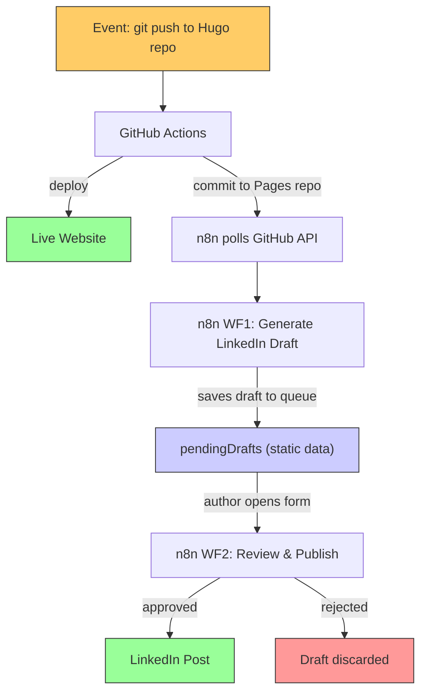
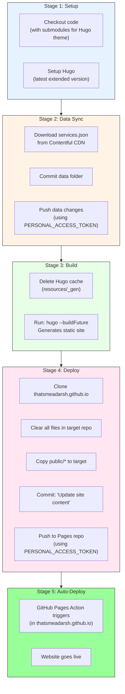
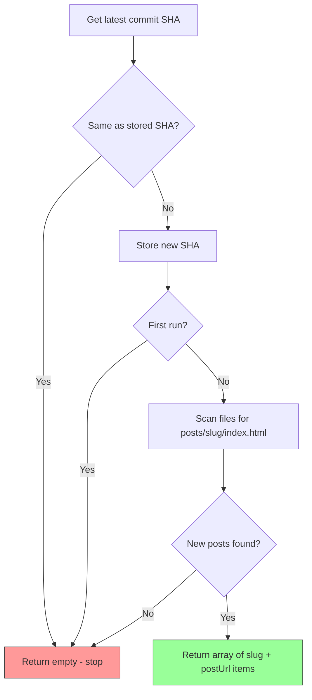
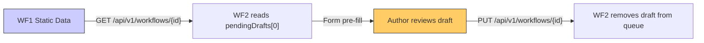
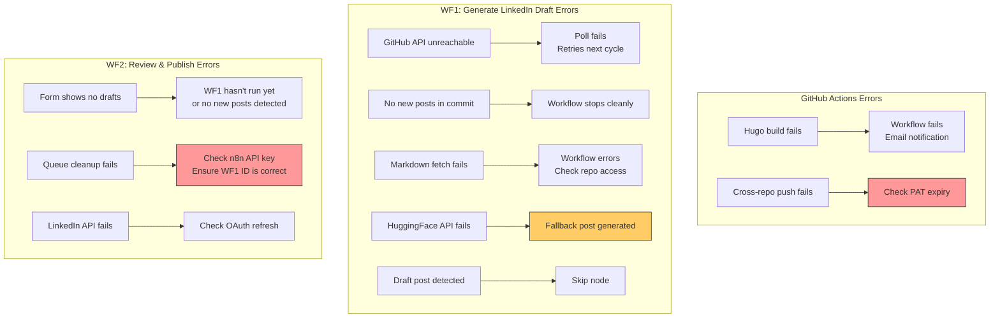

# Workflow Documentation

> Detailed functional documentation of the GitHub Actions pipeline and the two n8n workflows -- the three systems that power blog publishing with one intentional approval step.

---

## System Overview

The auto-publish pipeline consists of three systems triggered sequentially:



---

## Part 1: GitHub Actions Pipeline

**File**: `whataboutadarsh/.github/workflows/hugo.yml`
**Trigger**: Push to `main` branch

This is the **build and deploy** engine. It runs entirely in GitHub's cloud infrastructure.

### Pipeline Stages



### Key Configuration

| Setting | Value | Purpose |
|---|---|---|
| `persist-credentials: false` | Checkout step | Prevents default GITHUB_TOKEN from being used for pushes |
| `PERSONAL_ACCESS_TOKEN` | Repository secret | Enables cross-repository push (Hugo repo -> Pages repo) |
| `submodules: true` | Checkout step | Fetches Ananke Hugo theme |
| `fetch-depth: 0` | Checkout step | Full git history for Hugo's `.GitInfo` |
| `hugo --buildFuture` | Build step | Includes posts with future `date` values in the build output |
| `public/` in `.gitignore` | Source repo | Build output is not committed; runner copies it directly to Pages repo |
| `actions/checkout@v4` | Checkout step | Current version (v3 deprecated with Node.js 16) |
| `peaceiris/actions-hugo@v3` | Setup Hugo step | Current version (v2 deprecated with Node.js 16) |

---

## Part 2: n8n Workflow 1 -- Generate LinkedIn Draft

**File**: `workflows/auto-publish-workflow.json`
**Trigger**: Schedule (every 5 minutes)
**Total Nodes**: 10 (9 active + 1 no-op)

### Workflow Canvas

```
Poll Every  -> Fetch     -> Extract    -> Fetch    -> Parse     -> Is Not  -> Prepare  -> AI Generate -> Save Draft
5 Minutes     Latest       New Post      Post       Front       Draft?     HF          LinkedIn        for Review
              Deployment   Slugs         Markdown   matter                 Request      Post
                                                                  |
                                                                  v
                                                              Skip (Draft)
```


### Node-by-Node Documentation

---

#### Node 1: Poll Every 5 Minutes

| Property | Value |
|---|---|
| **Type** | `n8n-nodes-base.scheduleTrigger` |
| **Interval** | Every 5 minutes |

Runs the workflow on a fixed schedule. Each execution polls the GitHub API for the latest commit on the Pages repo.

**Why 5 minutes?** Balances responsiveness (typical GitHub Actions deployment takes 1-3 minutes) with API rate limits (GitHub allows 5000 authenticated requests/hour).

---

#### Node 2: Fetch Latest Deployment

| Property | Value |
|---|---|
| **Type** | `n8n-nodes-base.httpRequest` |
| **Method** | GET |
| **URL** | `https://api.github.com/repos/thatsmeadarsh/thatsmeadarsh.github.io/commits/main` |
| **Auth** | GitHub API (predefined credential) |
| **SSL** | Ignore SSL Issues: ON |

Fetches the latest commit on the Pages repo's `main` branch. The response includes:
- `sha` -- commit hash (used for change detection)
- `files[]` -- list of files changed with `filename` and `status` (added/modified/removed)

---

#### Node 3: Extract New Post Slugs

| Property | Value |
|---|---|
| **Type** | `n8n-nodes-base.code` (JavaScript) |
| **Purpose** | Detect new deployments, extract blog post slugs, and construct post URLs |

**State Management**: Uses `$getWorkflowStaticData('global')` to persist the last processed commit SHA between executions. This SHA survives n8n restarts and persists in the `n8n_data` Docker volume.

**Logic**:



**Three exit conditions** (returns empty, stopping the workflow):
1. Same commit as last poll -- no new deployment
2. First run -- stores initial SHA without processing
3. New commit but no new post files -- deployment only changed CSS/JS/etc.

**How post URLs are constructed**:

Hugo's build output mirrors the source structure exactly. A markdown file at `content/posts/my-post.md` in the source repo always produces `posts/my-post/index.html` in the Pages repo. This makes URL construction deterministic:

```
GitHub Pages commit files[]
        │
        │  file.filename = "posts/my-new-post/index.html"
        │  file.status   = "added"
        │
        ▼
Regex: /^posts\/([^\/]+)\/index\.html$/
        │
        │  match[1] = "my-new-post"   ← the slug
        │
        ▼
Post URL = "https://thatsmeadarsh.github.io/posts/my-new-post/"
```

The slug extracted from the Pages repo file path is **identical** to the URL path used by the live website. No guessing, no configuration -- the deployed file path IS the URL.

**Example**:

| Source file | Pages repo file | Slug | Live URL |
|---|---|---|---|
| `content/posts/building-auto-publish.md` | `posts/building-auto-publish/index.html` | `building-auto-publish` | `https://thatsmeadarsh.github.io/posts/building-auto-publish/` |
| `content/posts/n8n-linkedin-ai.md` | `posts/n8n-linkedin-ai/index.html` | `n8n-linkedin-ai` | `https://thatsmeadarsh.github.io/posts/n8n-linkedin-ai/` |

**Output per post**:
```json
{
  "slug": "building-auto-publish",
  "postUrl": "https://thatsmeadarsh.github.io/posts/building-auto-publish/"
}
```

---

#### Node 4: Fetch Post Markdown

| Property | Value |
|---|---|
| **Type** | `n8n-nodes-base.httpRequest` |
| **Method** | GET |
| **URL** | `https://raw.githubusercontent.com/thatsmeadarsh/whataboutadarsh/main/content/posts/{slug}.md` |
| **Response Format** | Text |
| **SSL** | Ignore SSL Issues: ON |

Fetches the original markdown source file from the Hugo repository. Needed because the Pages repo only contains built HTML, but we need the original markdown with TOML frontmatter.

---

#### Node 5: Parse Frontmatter

| Property | Value |
|---|---|
| **Type** | `n8n-nodes-base.code` (JavaScript) |
| **Purpose** | Extract structured metadata from Hugo's TOML frontmatter |

Retrieves `slug` and `postUrl` from the Extract New Post Slugs node via `$('Extract New Post Slugs').item.json`.

**Supported Frontmatter Format** (Hugo TOML):
```toml
+++
title = 'My Blog Post Title'
date = 2026-03-14T10:00:00+01:00
draft = false
tags = ['AI', 'MCP', 'Automation']
categories = ['Technology', 'Software Engineering']
+++
```

**Output Schema**:
```json
{
  "title": "My Blog Post Title",
  "date": "2026-03-14T10:00:00+01:00",
  "draft": false,
  "tags": ["AI", "MCP", "Automation"],
  "categories": ["Technology", "Software Engineering"],
  "slug": "my-blog-post",
  "postUrl": "https://thatsmeadarsh.github.io/posts/my-blog-post/",
  "excerpt": "First 500 words of the article body..."
}
```

---

#### Node 6: Is Not Draft?

| Property | Value |
|---|---|
| **Type** | `n8n-nodes-base.if` |
| **Condition** | `$json.draft === false` |
| **True** | Continue to AI generation |
| **False** | Skip (no LinkedIn post) |

---

#### Node 7: Prepare HF Request

| Property | Value |
|---|---|
| **Type** | `n8n-nodes-base.code` (JavaScript) |
| **Purpose** | Build a safe, properly escaped JSON request body for the AI API |

---

#### Node 8: AI Generate LinkedIn Post

| Property | Value |
|---|---|
| **Type** | `n8n-nodes-base.httpRequest` |
| **Method** | POST |
| **URL** | `https://router.huggingface.co/sambanova/v1/chat/completions` |
| **Auth** | Header Auth (`Authorization: Bearer hf_...`) |
| **SSL** | Ignore SSL Issues: ON |
| **Timeout** | 30 seconds |

**Model**: `Meta-Llama-3.1-8B-Instruct` via SambaNova provider. Free tier, OpenAI-compatible API.

---

#### Node 9: Save Draft for Review

| Property | Value |
|---|---|
| **Type** | `n8n-nodes-base.code` (JavaScript) |
| **Purpose** | Save the AI-generated draft to a FIFO queue in workflow static data |

This node bridges WF1 and WF2. Instead of publishing immediately, it stores the draft in `$getWorkflowStaticData('global').pendingDrafts` -- an array that acts as a FIFO queue. WF2 reads from and cleans up this queue via the n8n internal API.

**Logic**:
1. Extracts AI text from the HuggingFace response (tries `choices[0].message.content`, then `[0].generated_text`, then falls back to a simple title + URL + hashtags post)
2. Builds a draft object with all data needed for review and publishing
3. Pushes the draft onto the `pendingDrafts` array

**Draft object schema**:
```json
{
  "title": "My Blog Post Title",
  "postUrl": "https://thatsmeadarsh.github.io/posts/my-post/",
  "linkedinText": "AI-generated LinkedIn post text...",
  "slug": "my-post",
  "createdAt": "2026-03-15T10:00:00.000Z"
}
```

**Why static data?** The `pendingDrafts` array persists across workflow executions and n8n restarts (stored in the `n8n_data` Docker volume). It provides a lightweight inter-workflow communication channel without requiring an external database.

---

#### Node 10: Skip (Draft)

| Property | Value |
|---|---|
| **Type** | `n8n-nodes-base.noOp` |
| **Purpose** | Terminal node for draft posts (false branch of Is Not Draft?) |

---

## Part 3: n8n Workflow 2 -- Review & Publish to LinkedIn

**File**: `workflows/review-and-publish-workflow.json`
**Trigger**: Form submission at `http://localhost:5678/form/linkedin-review-form`
**Total Nodes**: 12

This workflow provides a browser-based review form for the author to approve, edit, or reject AI-generated LinkedIn drafts before publishing.

### Workflow Canvas

```
Load Draft -> Fetch Draft -> Extract   -> Review  -> Approved? -> Get       -> Prepare  -> Post to
(Form         from WF1       Latest      & Edit                  LinkedIn     LinkedIn    LinkedIn
 Trigger)                    Draft       (Form)        |          Profile      Post
                                                       v
                                                    Rejected
                                                       |
                                                       v
                                         (both branches converge)
                                                       |
                                                       v
                                         Fetch Draft -> Prepare  -> Remove Draft
                                         for Cleanup    Queue       from Queue
                                                        Cleanup
```


### Cross-Workflow Communication

WF2 communicates with WF1 through the n8n internal API:



**Authentication**: WF2 uses an n8n API key (passed via Header Auth) to read and write WF1's workflow data. This key is configured in n8n Settings > API.

### Node-by-Node Documentation

---

#### Node 1: Load Draft

| Property | Value |
|---|---|
| **Type** | `n8n-nodes-base.formTrigger` |
| **Form Path** | `linkedin-review-form` |
| **Page** | Page 1 -- submit button "Load Latest Draft" |

The entry point for the review flow. The author navigates to `http://localhost:5678/form/linkedin-review-form` and clicks "Load Latest Draft" to fetch the oldest pending draft from WF1's queue.

---

#### Node 2: Fetch Draft from WF1

| Property | Value |
|---|---|
| **Type** | `n8n-nodes-base.httpRequest` |
| **Method** | GET |
| **URL** | `http://localhost:5678/api/v1/workflows/{wf1_id}` |
| **Auth** | Header Auth (n8n API key) |

Reads WF1's full workflow definition, including its `staticData` field which contains the `pendingDrafts` array.

---

#### Node 3: Extract Latest Draft

| Property | Value |
|---|---|
| **Type** | `n8n-nodes-base.code` (JavaScript) |
| **Purpose** | Read the oldest draft from WF1's pendingDrafts queue (FIFO) |

Parses `staticData` from WF1's workflow JSON and reads `pendingDrafts[0]` -- the oldest unreviewed draft. If the queue is empty, returns a message indicating no drafts are available.

---

#### Node 4: Review & Edit

| Property | Value |
|---|---|
| **Type** | `n8n-nodes-base.form` |
| **Page** | Page 2 -- editable form fields |

Displays a form pre-filled with the draft data using `defaultValue` expressions:
- **Title** (read-only): `{{ $json.title }}`
- **Post URL** (read-only): `{{ $json.postUrl }}`
- **LinkedIn Text** (editable textarea): `{{ $json.linkedinText }}`
- **Approval** (dropdown): Approve / Reject

The author can edit the AI-generated LinkedIn text before approving, or reject the draft entirely.

---

#### Node 5: Approved?

| Property | Value |
|---|---|
| **Type** | `n8n-nodes-base.if` |
| **Condition** | Checks the form's approval field value |
| **True** | Continue to LinkedIn publishing |
| **False** | Rejected (NoOp) |

---

#### Node 6: Get LinkedIn Profile

| Property | Value |
|---|---|
| **Type** | `n8n-nodes-base.httpRequest` |
| **Method** | GET |
| **URL** | `https://api.linkedin.com/v2/userinfo` |
| **Auth** | LinkedIn OAuth2 |

Returns the `sub` field -- the person URN ID needed for posting.

---

#### Node 7: Prepare LinkedIn Post

| Property | Value |
|---|---|
| **Type** | `n8n-nodes-base.code` (JavaScript) |
| **Purpose** | Build LinkedIn UGC Post API body for immediate publishing |

Builds the request body for `POST /v2/ugcPosts` using the (potentially edited) LinkedIn text from the form and the person URN from the previous node.

**Note**: `lifecycleState: SCHEDULED` with `scheduledPublishTime` requires LinkedIn Marketing Partner access and returns a 403 for standard developer apps. Do not use `SCHEDULED`.

**Post body**:
```json
{
  "author": "urn:li:person:{personId}",
  "lifecycleState": "PUBLISHED",
  "specificContent": {
    "com.linkedin.ugc.ShareContent": {
      "shareCommentary": { "text": "Reviewed post text..." },
      "shareMediaCategory": "ARTICLE",
      "media": [{
        "status": "READY",
        "originalUrl": "https://thatsmeadarsh.github.io/posts/my-post/",
        "title": { "text": "Post Title" }
      }]
    }
  },
  "visibility": {
    "com.linkedin.ugc.MemberNetworkVisibility": "PUBLIC"
  }
}
```

LinkedIn crawls the `originalUrl` to generate the article card preview. Since n8n only fires after a new commit appears on the Pages repo, the URL is already live and crawlable.

---

#### Node 8: Post to LinkedIn

| Property | Value |
|---|---|
| **Type** | `n8n-nodes-base.httpRequest` |
| **Method** | POST |
| **URL** | `https://api.linkedin.com/v2/ugcPosts` |
| **Auth** | LinkedIn OAuth2 |

Creates and immediately publishes the post. Returns the post URN on success (e.g., `urn:li:ugcPost:1234567890`).

---

#### Node 9: Rejected

| Property | Value |
|---|---|
| **Type** | `n8n-nodes-base.noOp` |
| **Purpose** | Terminal node for the rejection branch |

---

#### Node 10: Fetch Draft for Cleanup

| Property | Value |
|---|---|
| **Type** | `n8n-nodes-base.httpRequest` |
| **Method** | GET |
| **URL** | `http://localhost:5678/api/v1/workflows/{wf1_id}` |
| **Auth** | Header Auth (n8n API key) |

Both the approved and rejected branches converge here. Re-fetches WF1's workflow data to get a fresh copy of the `pendingDrafts` array before modifying it.

**Why re-fetch?** WF1 may have added new drafts to the queue while the author was reviewing. A fresh read ensures no drafts are lost during cleanup.

---

#### Node 11: Prepare Queue Cleanup

| Property | Value |
|---|---|
| **Type** | `n8n-nodes-base.code` (JavaScript) |
| **Purpose** | Remove the oldest draft from the pendingDrafts queue and build a PUT body |

Removes `pendingDrafts[0]` (the draft that was just reviewed) from the array and constructs the full workflow JSON body needed for the PUT request to update WF1's static data.

---

#### Node 12: Remove Draft from Queue

| Property | Value |
|---|---|
| **Type** | `n8n-nodes-base.httpRequest` |
| **Method** | PUT |
| **URL** | `http://localhost:5678/api/v1/workflows/{wf1_id}` |
| **Auth** | Header Auth (n8n API key) |

Updates WF1's workflow definition with the modified `staticData` (one fewer draft in the queue). This ensures the same draft is not presented again on the next form submission.

---

## Error Handling



### Fault Isolation

| Failure | Website Impact | LinkedIn Impact |
|---|---|---|
| GitHub Actions fails | Site not updated | n8n sees no new commit -- no action |
| GitHub API rate limit | No impact | WF1 poll fails; retries in 5 minutes |
| WF1 fails | No impact | No draft generated; nothing to review |
| HuggingFace API down | No impact | Fallback text used in draft |
| WF2 form shows no drafts | No impact | WF1 hasn't detected new posts yet |
| Queue cleanup fails | No impact | Draft stays in queue; check n8n API key and WF1 ID |
| LinkedIn API down | No impact | Post not published; draft already removed from queue |

---

*Last Updated: 2026-03-15*
*Project: n8n-Powered Auto Web Publish*
