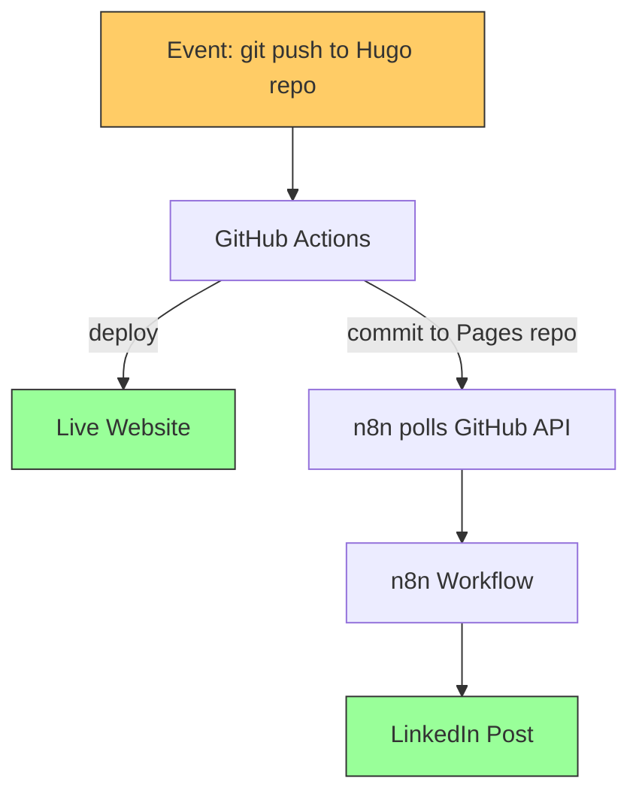
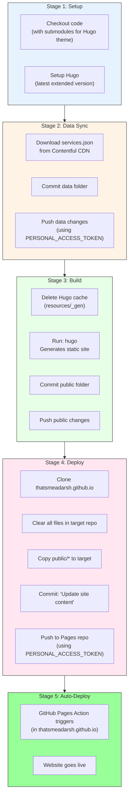
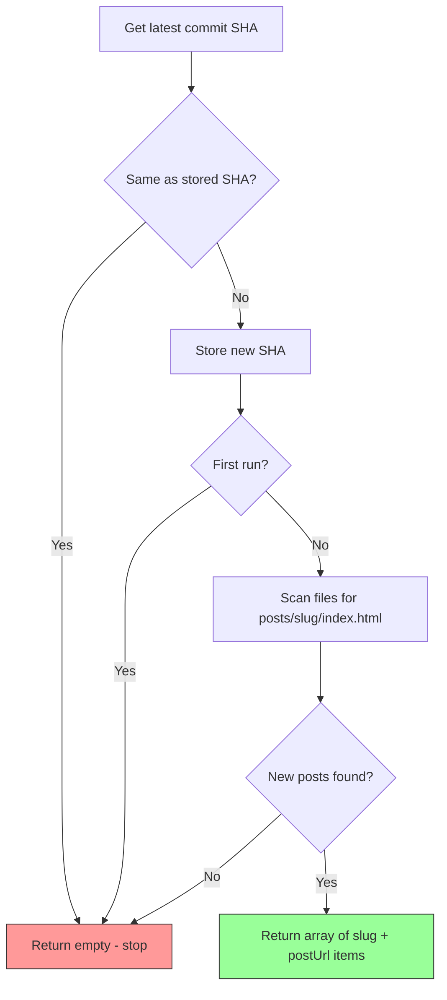
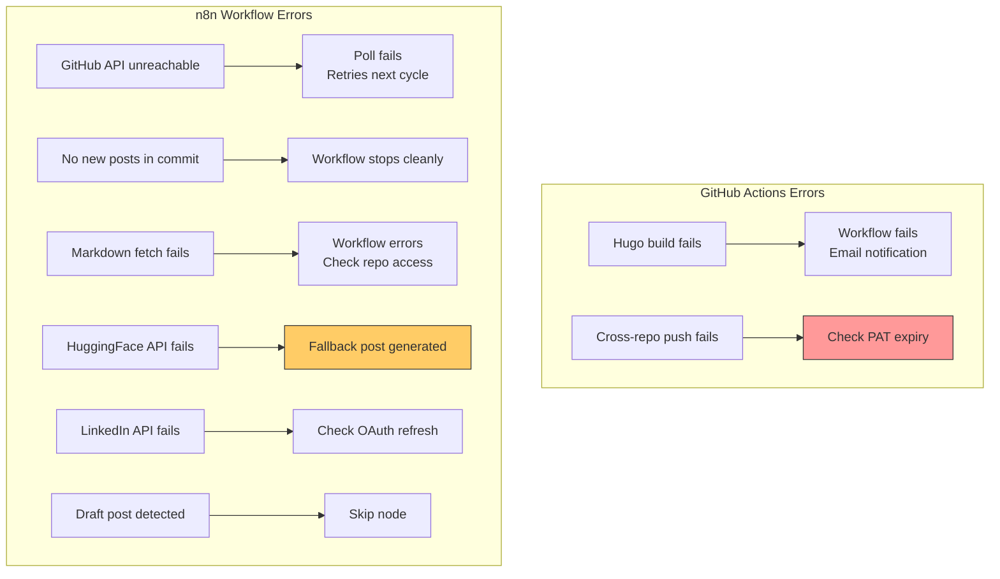

# Workflow Documentation

> Detailed functional documentation of the GitHub Actions pipeline and every node in the n8n workflow -- the two systems that power zero-touch blog publishing.

---

## System Overview

The auto-publish pipeline consists of two systems triggered sequentially:



---

## Part 1: GitHub Actions Pipeline

**File**: `whataboutadarsh/.github/workflows/hugo.yml`
**Trigger**: Push to `main` branch

This is the **build and deploy** engine. It runs entirely in GitHub's cloud infrastructure.

### Pipeline Stages



### Key Configuration

| Setting | Value | Purpose |
|---|---|---|
| `persist-credentials: false` | Checkout step | Prevents default GITHUB_TOKEN from being used for pushes |
| `PERSONAL_ACCESS_TOKEN` | Repository secret | Enables cross-repository push (Hugo repo -> Pages repo) |
| `submodules: true` | Checkout step | Fetches Ananke Hugo theme |
| `fetch-depth: 0` | Checkout step | Full git history for Hugo's `.GitInfo` |

---

## Part 2: n8n Workflow

**File**: `workflows/auto-publish-workflow.json`
**Trigger**: Schedule (every 5 minutes)
**Total Nodes**: 13 (12 active + 1 no-op)

### Workflow Canvas

```
Poll Every  -> Fetch     -> Extract    -> Fetch    -> Parse     -> Is Not  -> Prepare  -> AI Generate -> Format   -> Get       -> Prepare  -> Post to
5 Minutes     Latest       New Post      Post       Front       Draft?     HF          LinkedIn       LinkedIn    LinkedIn     LinkedIn    LinkedIn
              Deployment   Slugs         Markdown   matter                 Request      Post           Post       Profile      Post
                                                                  |
                                                                  v
                                                              Skip (Draft)
```

### Node-by-Node Documentation

---

#### Node 1: Poll Every 5 Minutes

| Property | Value |
|---|---|
| **Type** | `n8n-nodes-base.scheduleTrigger` |
| **Interval** | Every 5 minutes |

Runs the workflow on a fixed schedule. Each execution polls the GitHub API for the latest commit on the Pages repo.

**Why 5 minutes?** Balances responsiveness (typical GitHub Actions deployment takes 1-3 minutes) with API rate limits (GitHub allows 5000 authenticated requests/hour).

---

#### Node 2: Fetch Latest Deployment

| Property | Value |
|---|---|
| **Type** | `n8n-nodes-base.httpRequest` |
| **Method** | GET |
| **URL** | `https://api.github.com/repos/thatsmeadarsh/thatsmeadarsh.github.io/commits/main` |
| **Auth** | GitHub API (predefined credential) |
| **SSL** | Ignore SSL Issues: ON |

Fetches the latest commit on the Pages repo's `main` branch. The response includes:
- `sha` -- commit hash (used for change detection)
- `files[]` -- list of files changed with `filename` and `status` (added/modified/removed)

---

#### Node 3: Extract New Post Slugs

| Property | Value |
|---|---|
| **Type** | `n8n-nodes-base.code` (JavaScript) |
| **Purpose** | Detect new deployments, extract blog post slugs, and construct post URLs |

**State Management**: Uses `$getWorkflowStaticData('global')` to persist the last processed commit SHA between executions. This SHA survives n8n restarts and persists in the `n8n_data` Docker volume.

**Logic**:



**Three exit conditions** (returns empty, stopping the workflow):
1. Same commit as last poll -- no new deployment
2. First run -- stores initial SHA without processing
3. New commit but no new post files -- deployment only changed CSS/JS/etc.

**How post URLs are constructed**:

Hugo's build output mirrors the source structure exactly. A markdown file at `content/posts/my-post.md` in the source repo always produces `posts/my-post/index.html` in the Pages repo. This makes URL construction deterministic:

```
GitHub Pages commit files[]
        │
        │  file.filename = "posts/my-new-post/index.html"
        │  file.status   = "added"
        │
        ▼
Regex: /^posts\/([^\/]+)\/index\.html$/
        │
        │  match[1] = "my-new-post"   ← the slug
        │
        ▼
Post URL = "https://thatsmeadarsh.github.io/posts/my-new-post/"
```

The slug extracted from the Pages repo file path is **identical** to the URL path used by the live website. No guessing, no configuration -- the deployed file path IS the URL.

**Example**:

| Source file | Pages repo file | Slug | Live URL |
|---|---|---|---|
| `content/posts/building-auto-publish.md` | `posts/building-auto-publish/index.html` | `building-auto-publish` | `https://thatsmeadarsh.github.io/posts/building-auto-publish/` |
| `content/posts/n8n-linkedin-ai.md` | `posts/n8n-linkedin-ai/index.html` | `n8n-linkedin-ai` | `https://thatsmeadarsh.github.io/posts/n8n-linkedin-ai/` |

**Output per post**:
```json
{
  "slug": "building-auto-publish",
  "postUrl": "https://thatsmeadarsh.github.io/posts/building-auto-publish/"
}
```

---

#### Node 4: Fetch Post Markdown

| Property | Value |
|---|---|
| **Type** | `n8n-nodes-base.httpRequest` |
| **Method** | GET |
| **URL** | `https://raw.githubusercontent.com/thatsmeadarsh/whataboutadarsh/main/content/posts/{slug}.md` |
| **Response Format** | Text |
| **SSL** | Ignore SSL Issues: ON |

Fetches the original markdown source file from the Hugo repository. Needed because the Pages repo only contains built HTML, but we need the original markdown with TOML frontmatter.

---

#### Node 5: Parse Frontmatter

| Property | Value |
|---|---|
| **Type** | `n8n-nodes-base.code` (JavaScript) |
| **Purpose** | Extract structured metadata from Hugo's TOML frontmatter |

Retrieves `slug` and `postUrl` from the Extract New Post Slugs node via `$('Extract New Post Slugs').item.json`.

**Supported Frontmatter Format** (Hugo TOML):
```toml
+++
title = 'My Blog Post Title'
date = 2026-03-14T10:00:00+01:00
draft = false
tags = ['AI', 'MCP', 'Automation']
categories = ['Technology', 'Software Engineering']
+++
```

**Output Schema**:
```json
{
  "title": "My Blog Post Title",
  "date": "2026-03-14T10:00:00+01:00",
  "draft": false,
  "tags": ["AI", "MCP", "Automation"],
  "categories": ["Technology", "Software Engineering"],
  "slug": "my-blog-post",
  "postUrl": "https://thatsmeadarsh.github.io/posts/my-blog-post/",
  "excerpt": "First 500 words of the article body..."
}
```

---

#### Node 6: Is Not Draft?

| Property | Value |
|---|---|
| **Type** | `n8n-nodes-base.if` |
| **Condition** | `$json.draft === false` |
| **True** | Continue to AI generation |
| **False** | Skip (no LinkedIn post) |

---

#### Node 7: Prepare HF Request

| Property | Value |
|---|---|
| **Type** | `n8n-nodes-base.code` (JavaScript) |
| **Purpose** | Build a safe, properly escaped JSON request body for the AI API |

---

#### Node 8: AI Generate LinkedIn Post

| Property | Value |
|---|---|
| **Type** | `n8n-nodes-base.httpRequest` |
| **Method** | POST |
| **URL** | `https://router.huggingface.co/sambanova/v1/chat/completions` |
| **Auth** | Header Auth (`Authorization: Bearer hf_...`) |
| **SSL** | Ignore SSL Issues: ON |
| **Timeout** | 30 seconds |

**Model**: `Meta-Llama-3.1-8B-Instruct` via SambaNova provider. Free tier, OpenAI-compatible API.

---

#### Node 9: Format LinkedIn Post

| Property | Value |
|---|---|
| **Type** | `n8n-nodes-base.code` (JavaScript) |
| **Purpose** | Extract AI text with fallback handling |

Tries `choices[0].message.content`, falls back to `[0].generated_text`, then to a simple title + URL + hashtags post.

---

#### Node 10: Get LinkedIn Profile

| Property | Value |
|---|---|
| **Type** | `n8n-nodes-base.httpRequest` |
| **Method** | GET |
| **URL** | `https://api.linkedin.com/v2/userinfo` |
| **Auth** | LinkedIn OAuth2 |

Returns the `sub` field -- the person URN ID.

---

#### Node 11: Prepare LinkedIn Post

| Property | Value |
|---|---|
| **Type** | `n8n-nodes-base.code` (JavaScript) |
| **Purpose** | Build LinkedIn UGC Post API body as a **scheduled post** |

Creates a scheduled post set to publish **24 hours from the time of execution**. This gives you a review window to edit or publish early from LinkedIn's UI before it auto-publishes.

**Scheduled post body**:
```json
{
  "author": "urn:li:person:{personId}",
  "lifecycleState": "SCHEDULED",
  "scheduledPublishTime": 1234567890000,
  "specificContent": {
    "com.linkedin.ugc.ShareContent": {
      "shareCommentary": { "text": "AI-generated post text..." },
      "shareMediaCategory": "ARTICLE",
      "media": [{
        "status": "READY",
        "originalUrl": "https://thatsmeadarsh.github.io/posts/my-post/",
        "title": { "text": "Post Title" }
      }]
    }
  },
  "visibility": {
    "com.linkedin.ugc.MemberNetworkVisibility": "PUBLIC"
  }
}
```

**`scheduledPublishTime`** is a Unix timestamp in milliseconds: `Date.now() + (24 * 60 * 60 * 1000)`.

**How to review and publish from LinkedIn**:

1. Open **LinkedIn** (web or mobile)
2. Go to **Me** → **Posts & Activity** → **Scheduled**
3. Find the scheduled post (shows with the article link preview)
4. Click **Edit** to modify the text if needed
5. Click **Post now** to publish immediately, or leave it to auto-publish in 24 hours

---

#### Node 12: Post to LinkedIn

| Property | Value |
|---|---|
| **Type** | `n8n-nodes-base.httpRequest` |
| **Method** | POST |
| **URL** | `https://api.linkedin.com/v2/ugcPosts` |
| **Auth** | LinkedIn OAuth2 |

Creates the scheduled post. Returns the post URN on success (e.g., `urn:li:ugcPost:1234567890`).

---

#### Node 13: Skip (Draft)

| Property | Value |
|---|---|
| **Type** | `n8n-nodes-base.noOp` |
| **Purpose** | Terminal node for draft posts |

---

## Error Handling



### Fault Isolation

| Failure | Website Impact | LinkedIn Impact |
|---|---|---|
| GitHub Actions fails | Site not updated | n8n sees no new commit -- no action |
| GitHub API rate limit | No impact | Poll fails; retries in 5 minutes |
| n8n workflow fails | No impact | No LinkedIn post |
| HuggingFace API down | No impact | Fallback text used |
| LinkedIn API down | No impact | Post not published |

---

*Last Updated: 2026-03-14*
*Project: n8n-Powered Auto Web Publish*
