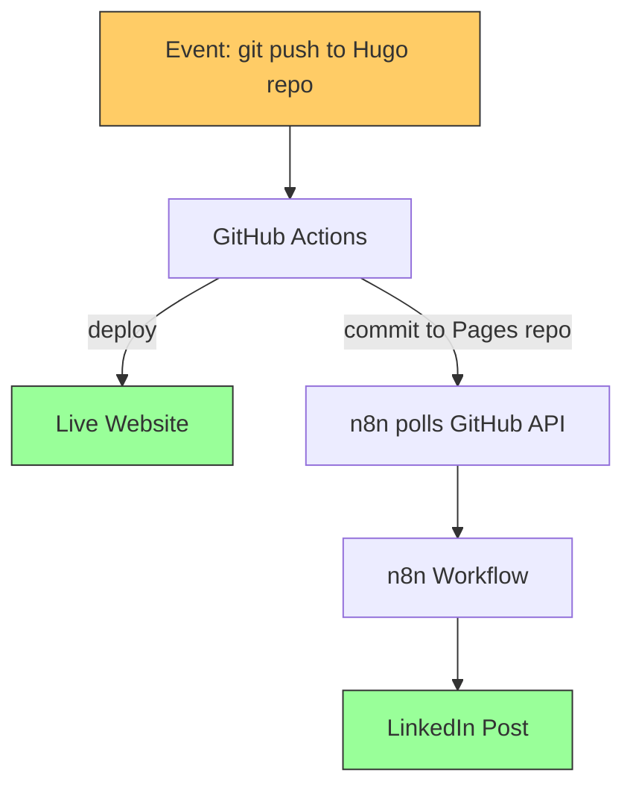
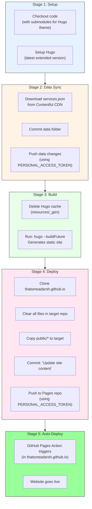
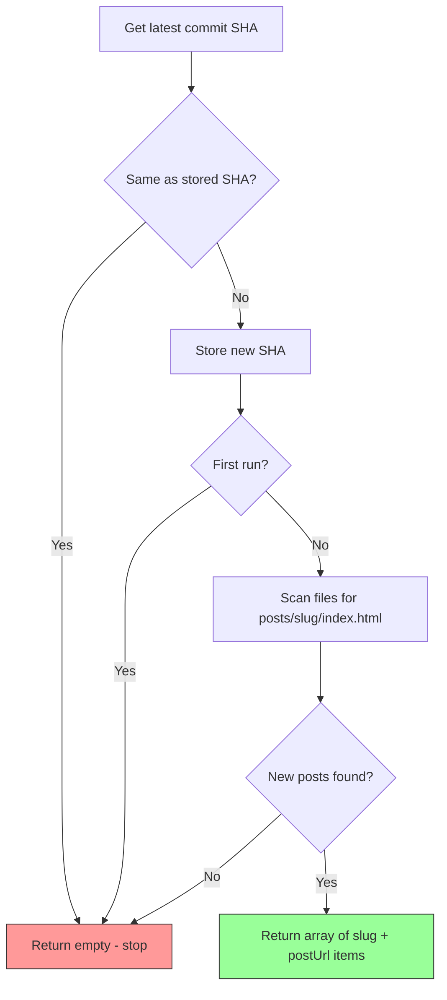
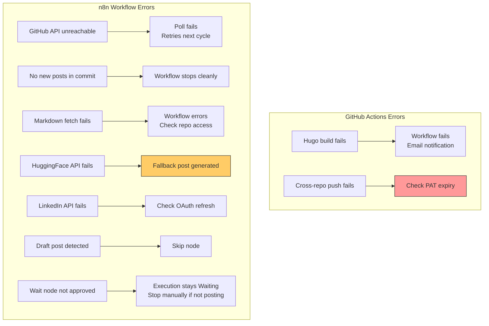

# Workflow Documentation

> Detailed functional documentation of the GitHub Actions pipeline and every node in the n8n workflow -- the two systems that power zero-touch blog publishing.

---

## System Overview

The auto-publish pipeline consists of two systems triggered sequentially:



---

## Part 1: GitHub Actions Pipeline

**File**: `whataboutadarsh/.github/workflows/hugo.yml`
**Trigger**: Push to `main` branch

This is the **build and deploy** engine. It runs entirely in GitHub's cloud infrastructure.

### Pipeline Stages



### Key Configuration

| Setting | Value | Purpose |
|---|---|---|
| `persist-credentials: false` | Checkout step | Prevents default GITHUB_TOKEN from being used for pushes |
| `PERSONAL_ACCESS_TOKEN` | Repository secret | Enables cross-repository push (Hugo repo -> Pages repo) |
| `submodules: true` | Checkout step | Fetches Ananke Hugo theme |
| `fetch-depth: 0` | Checkout step | Full git history for Hugo's `.GitInfo` |
| `hugo --buildFuture` | Build step | Includes posts with future `date` values in the build output |
| `public/` in `.gitignore` | Source repo | Build output is not committed; runner copies it directly to Pages repo |
| `actions/checkout@v4` | Checkout step | Current version (v3 deprecated with Node.js 16) |
| `peaceiris/actions-hugo@v3` | Setup Hugo step | Current version (v2 deprecated with Node.js 16) |

---

## Part 2: n8n Workflow

**File**: `workflows/auto-publish-workflow.json`
**Trigger**: Schedule (every 5 minutes)
**Total Nodes**: 14 (13 active + 1 no-op)

### Workflow Canvas

```
Poll Every  -> Fetch     -> Extract    -> Fetch    -> Parse     -> Is Not  -> Prepare  -> AI Generate -> Format   -> Wait for  -> Get       -> Prepare  -> Post to
5 Minutes     Latest       New Post      Post       Front       Draft?     HF          LinkedIn       LinkedIn    Approval      LinkedIn     LinkedIn    LinkedIn
              Deployment   Slugs         Markdown   matter                 Request      Post           Post        (n8n UI)    Profile      Post
                                                                  |
                                                                  v
                                                              Skip (Draft)
```

### Node-by-Node Documentation

---

#### Node 1: Poll Every 5 Minutes

| Property | Value |
|---|---|
| **Type** | `n8n-nodes-base.scheduleTrigger` |
| **Interval** | Every 5 minutes |

Runs the workflow on a fixed schedule. Each execution polls the GitHub API for the latest commit on the Pages repo.

**Why 5 minutes?** Balances responsiveness (typical GitHub Actions deployment takes 1-3 minutes) with API rate limits (GitHub allows 5000 authenticated requests/hour).

---

#### Node 2: Fetch Latest Deployment

| Property | Value |
|---|---|
| **Type** | `n8n-nodes-base.httpRequest` |
| **Method** | GET |
| **URL** | `https://api.github.com/repos/thatsmeadarsh/thatsmeadarsh.github.io/commits/main` |
| **Auth** | GitHub API (predefined credential) |
| **SSL** | Ignore SSL Issues: ON |

Fetches the latest commit on the Pages repo's `main` branch. The response includes:
- `sha` -- commit hash (used for change detection)
- `files[]` -- list of files changed with `filename` and `status` (added/modified/removed)

---

#### Node 3: Extract New Post Slugs

| Property | Value |
|---|---|
| **Type** | `n8n-nodes-base.code` (JavaScript) |
| **Purpose** | Detect new deployments, extract blog post slugs, and construct post URLs |

**State Management**: Uses `$getWorkflowStaticData('global')` to persist the last processed commit SHA between executions. This SHA survives n8n restarts and persists in the `n8n_data` Docker volume.

**Logic**:



**Three exit conditions** (returns empty, stopping the workflow):
1. Same commit as last poll -- no new deployment
2. First run -- stores initial SHA without processing
3. New commit but no new post files -- deployment only changed CSS/JS/etc.

**How post URLs are constructed**:

Hugo's build output mirrors the source structure exactly. A markdown file at `content/posts/my-post.md` in the source repo always produces `posts/my-post/index.html` in the Pages repo. This makes URL construction deterministic:

```
GitHub Pages commit files[]
        │
        │  file.filename = "posts/my-new-post/index.html"
        │  file.status   = "added"
        │
        ▼
Regex: /^posts\/([^\/]+)\/index\.html$/
        │
        │  match[1] = "my-new-post"   ← the slug
        │
        ▼
Post URL = "https://thatsmeadarsh.github.io/posts/my-new-post/"
```

The slug extracted from the Pages repo file path is **identical** to the URL path used by the live website. No guessing, no configuration -- the deployed file path IS the URL.

**Example**:

| Source file | Pages repo file | Slug | Live URL |
|---|---|---|---|
| `content/posts/building-auto-publish.md` | `posts/building-auto-publish/index.html` | `building-auto-publish` | `https://thatsmeadarsh.github.io/posts/building-auto-publish/` |
| `content/posts/n8n-linkedin-ai.md` | `posts/n8n-linkedin-ai/index.html` | `n8n-linkedin-ai` | `https://thatsmeadarsh.github.io/posts/n8n-linkedin-ai/` |

**Output per post**:
```json
{
  "slug": "building-auto-publish",
  "postUrl": "https://thatsmeadarsh.github.io/posts/building-auto-publish/"
}
```

---

#### Node 4: Fetch Post Markdown

| Property | Value |
|---|---|
| **Type** | `n8n-nodes-base.httpRequest` |
| **Method** | GET |
| **URL** | `https://raw.githubusercontent.com/thatsmeadarsh/whataboutadarsh/main/content/posts/{slug}.md` |
| **Response Format** | Text |
| **SSL** | Ignore SSL Issues: ON |

Fetches the original markdown source file from the Hugo repository. Needed because the Pages repo only contains built HTML, but we need the original markdown with TOML frontmatter.

---

#### Node 5: Parse Frontmatter

| Property | Value |
|---|---|
| **Type** | `n8n-nodes-base.code` (JavaScript) |
| **Purpose** | Extract structured metadata from Hugo's TOML frontmatter |

Retrieves `slug` and `postUrl` from the Extract New Post Slugs node via `$('Extract New Post Slugs').item.json`.

**Supported Frontmatter Format** (Hugo TOML):
```toml
+++
title = 'My Blog Post Title'
date = 2026-03-14T10:00:00+01:00
draft = false
tags = ['AI', 'MCP', 'Automation']
categories = ['Technology', 'Software Engineering']
+++
```

**Output Schema**:
```json
{
  "title": "My Blog Post Title",
  "date": "2026-03-14T10:00:00+01:00",
  "draft": false,
  "tags": ["AI", "MCP", "Automation"],
  "categories": ["Technology", "Software Engineering"],
  "slug": "my-blog-post",
  "postUrl": "https://thatsmeadarsh.github.io/posts/my-blog-post/",
  "excerpt": "First 500 words of the article body..."
}
```

---

#### Node 6: Is Not Draft?

| Property | Value |
|---|---|
| **Type** | `n8n-nodes-base.if` |
| **Condition** | `$json.draft === false` |
| **True** | Continue to AI generation |
| **False** | Skip (no LinkedIn post) |

---

#### Node 7: Prepare HF Request

| Property | Value |
|---|---|
| **Type** | `n8n-nodes-base.code` (JavaScript) |
| **Purpose** | Build a safe, properly escaped JSON request body for the AI API |

---

#### Node 8: AI Generate LinkedIn Post

| Property | Value |
|---|---|
| **Type** | `n8n-nodes-base.httpRequest` |
| **Method** | POST |
| **URL** | `https://router.huggingface.co/sambanova/v1/chat/completions` |
| **Auth** | Header Auth (`Authorization: Bearer hf_...`) |
| **SSL** | Ignore SSL Issues: ON |
| **Timeout** | 30 seconds |

**Model**: `Meta-Llama-3.1-8B-Instruct` via SambaNova provider. Free tier, OpenAI-compatible API.

---

#### Node 9: Format LinkedIn Post

| Property | Value |
|---|---|
| **Type** | `n8n-nodes-base.code` (JavaScript) |
| **Purpose** | Extract AI text with fallback handling |

Tries `choices[0].message.content`, falls back to `[0].generated_text`, then to a simple title + URL + hashtags post.

---

#### Node 10: Wait for Approval

| Property | Value |
|---|---|
| **Type** | `n8n-nodes-base.wait` |
| **Resume** | `webhook` |
| **Webhook Suffix** | `approve` |

Pauses the workflow execution and waits for a manual approval signal before proceeding to publish on LinkedIn. The execution remains in a **"Waiting"** state visible in the n8n UI.

**Why this exists**: LinkedIn's `lifecycleState: SCHEDULED` API requires Marketing Partner access and is rejected for standard developer apps. Instead of posting immediately (which bypasses review), the workflow pauses here to allow the author to review and edit the AI-generated post before it goes live.

**How to approve and publish**:

1. Open n8n at `http://localhost:5678`
2. Go to **Executions** (left sidebar)
3. Find the execution in **"Waiting"** state
4. Click on it to open the execution detail
5. In the **Wait for Approval** node, copy the `resumeUrl` from the node output
6. Open the `resumeUrl` in your browser to resume the execution
7. The workflow continues: fetches your LinkedIn profile, builds the post body, and publishes

> **Tip**: The execution will wait indefinitely until resumed or manually stopped. If you decide not to post, click **"Stop"** on the waiting execution.

---

#### Node 11: Get LinkedIn Profile

| Property | Value |
|---|---|
| **Type** | `n8n-nodes-base.httpRequest` |
| **Method** | GET |
| **URL** | `https://api.linkedin.com/v2/userinfo` |
| **Auth** | LinkedIn OAuth2 |

Returns the `sub` field -- the person URN ID.

---

#### Node 12: Prepare LinkedIn Post

| Property | Value |
|---|---|
| **Type** | `n8n-nodes-base.code` (JavaScript) |
| **Purpose** | Build LinkedIn UGC Post API body for immediate publishing |

Builds the request body for `POST /v2/ugcPosts`. The post is published immediately (`lifecycleState: PUBLISHED`) since the review window is handled by the Wait for Approval node upstream.

**Note**: `lifecycleState: SCHEDULED` with `scheduledPublishTime` requires LinkedIn Marketing Partner access and returns a 403 for standard developer apps. Do not use `SCHEDULED`.

**Post body**:
```json
{
  "author": "urn:li:person:{personId}",
  "lifecycleState": "PUBLISHED",
  "specificContent": {
    "com.linkedin.ugc.ShareContent": {
      "shareCommentary": { "text": "AI-generated post text..." },
      "shareMediaCategory": "ARTICLE",
      "media": [{
        "status": "READY",
        "originalUrl": "https://thatsmeadarsh.github.io/posts/my-post/",
        "title": { "text": "Post Title" }
      }]
    }
  },
  "visibility": {
    "com.linkedin.ugc.MemberNetworkVisibility": "PUBLIC"
  }
}
```

LinkedIn crawls the `originalUrl` to generate the article card preview. Since n8n only fires after a new commit appears on the Pages repo, the URL is already live and crawlable.

---

#### Node 13: Post to LinkedIn

| Property | Value |
|---|---|
| **Type** | `n8n-nodes-base.httpRequest` |
| **Method** | POST |
| **URL** | `https://api.linkedin.com/v2/ugcPosts` |
| **Auth** | LinkedIn OAuth2 |

Creates and immediately publishes the post. Returns the post URN on success (e.g., `urn:li:ugcPost:1234567890`).

---

#### Node 14: Skip (Draft)

| Property | Value |
|---|---|
| **Type** | `n8n-nodes-base.noOp` |
| **Purpose** | Terminal node for draft posts |

---

## Error Handling



### Fault Isolation

| Failure | Website Impact | LinkedIn Impact |
|---|---|---|
| GitHub Actions fails | Site not updated | n8n sees no new commit -- no action |
| GitHub API rate limit | No impact | Poll fails; retries in 5 minutes |
| n8n workflow fails | No impact | No LinkedIn post |
| HuggingFace API down | No impact | Fallback text used |
| LinkedIn API down | No impact | Post not published |
| Wait node not resumed | No impact | Execution stays Waiting; stop manually |

---

*Last Updated: 2026-03-15*
*Project: n8n-Powered Auto Web Publish*
