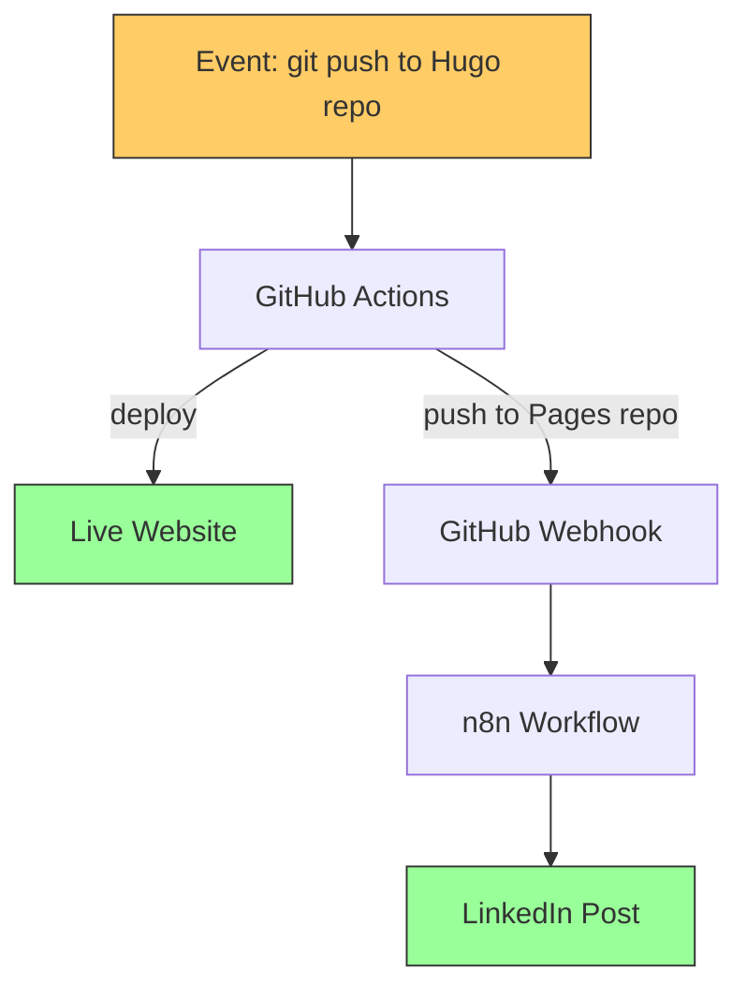
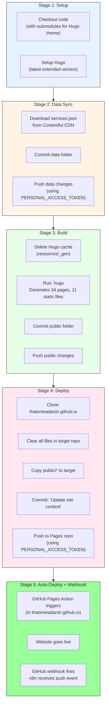
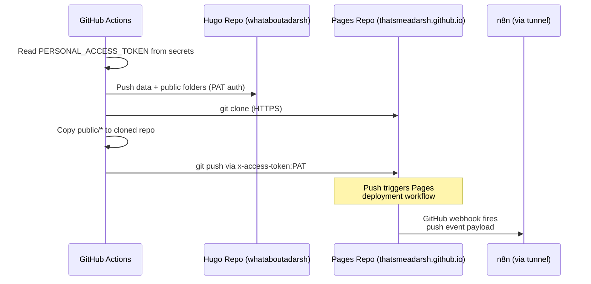
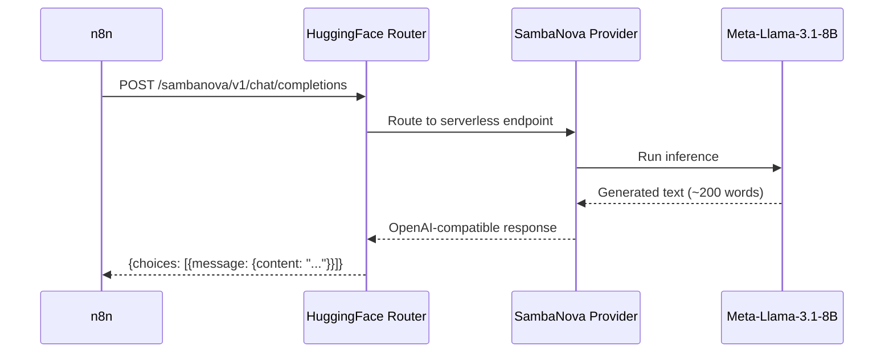
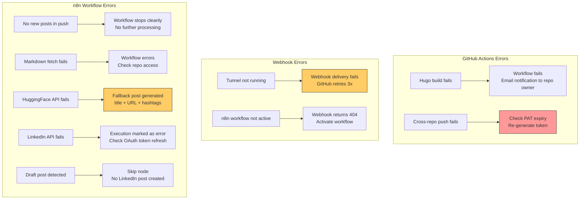

# Workflow Documentation

> Detailed functional documentation of the GitHub Actions pipeline and every node in the n8n workflow -- the two systems that power zero-touch blog publishing.

---

## System Overview

The auto-publish pipeline consists of two systems triggered sequentially:



---

## Part 1: GitHub Actions Pipeline

**File**: `whataboutadarsh/.github/workflows/hugo.yml`
**Trigger**: Push to `main` branch

This is the **build and deploy** engine. It runs entirely in GitHub's cloud infrastructure.

### Pipeline Stages



### Authentication Flow



### Key Configuration

| Setting | Value | Purpose |
|---|---|---|
| `persist-credentials: false` | Checkout step | Prevents default GITHUB_TOKEN from being used for pushes |
| `PERSONAL_ACCESS_TOKEN` | Repository secret | Enables cross-repository push (Hugo repo -> Pages repo) |
| `submodules: true` | Checkout step | Fetches Ananke Hugo theme |
| `fetch-depth: 0` | Checkout step | Full git history for Hugo's `.GitInfo` |

---

## Part 2: n8n Workflow

**File**: `workflows/auto-publish-workflow.json`
**Trigger**: GitHub webhook (push event on Pages repo)
**Total Nodes**: 12 (11 active + 1 no-op)

### Workflow Canvas

```
GitHub     Extract       Fetch       Parse       Is Not    Prepare    AI Generate   Format      Get         Prepare     Post to
Push    -> New Post   -> Post     -> Front   -> Draft? -> HF      -> LinkedIn   -> LinkedIn -> LinkedIn  -> LinkedIn  -> LinkedIn
Trigger    Slugs        Markdown    matter                Request     Post          Post       Profile     Post
                                                  |
                                                  v
                                              Skip (Draft)
```

### Node-by-Node Documentation

---

#### Node 1: GitHub Push Trigger

| Property | Value |
|---|---|
| **Type** | `n8n-nodes-base.githubTrigger` |
| **Event** | `push` |
| **Repository** | `thatsmeadarsh/thatsmeadarsh.github.io` |
| **Credentials** | GitHub API (Personal Access Token) |

Listens for push events on the GitHub Pages repository. When GitHub Actions pushes the built Hugo site to the Pages repo, this webhook fires and starts the workflow.

**Why watch the Pages repo?** This ensures the website is actually deployed before n8n generates and publishes the LinkedIn post. If we watched the Hugo source repo instead, the LinkedIn post might go out before the site is live.

**Webhook registration**: When the workflow is activated in n8n, it automatically registers a webhook on the GitHub repo via the GitHub API. The webhook URL points to n8n's public tunnel URL.

---

#### Node 2: Extract New Post Slugs

| Property | Value |
|---|---|
| **Type** | `n8n-nodes-base.code` (JavaScript) |
| **Purpose** | Parse the push event payload to find newly added blog posts |

**Logic**:

```mermaid
graph TD
    A[Push event payload] --> B{ref = main?}
    B -->|No| C[Return empty - stop]
    B -->|Yes| D[Scan commits[].added files]
    D --> E{Match posts/slug/index.html?}
    E -->|No matches| C
    E -->|Matches found| F[Return array of slug + postUrl items]

    style C fill:#ff9999,stroke:#333
    style F fill:#99ff99,stroke:#333
```

**Input**: GitHub push event with commits and file lists
**Output**: Array of items, each with `slug` and `postUrl`

If no new posts are found in the push (e.g., only CSS/JS changes), the node returns an empty array and the workflow stops.

**Handles multiple posts**: If a single push adds multiple new posts, each is returned as a separate item and processed independently through the rest of the workflow.

---

#### Node 3: Fetch Post Markdown

| Property | Value |
|---|---|
| **Type** | `n8n-nodes-base.httpRequest` |
| **Method** | GET |
| **URL** | `https://raw.githubusercontent.com/thatsmeadarsh/whataboutadarsh/main/content/posts/{slug}.md` |
| **Auth** | Header Auth (optional, for private repos) |
| **Response Format** | Text |

Fetches the original markdown source file from the Hugo repository. This is needed because the Pages repo only contains built HTML, but we need the original markdown with TOML frontmatter for metadata extraction and AI context.

**Why raw.githubusercontent.com?** Simple GET request that returns plain text markdown. No JSON parsing or base64 decoding needed.

---

#### Node 4: Parse Frontmatter

| Property | Value |
|---|---|
| **Type** | `n8n-nodes-base.code` (JavaScript) |
| **Purpose** | Extract structured metadata from Hugo's TOML frontmatter |

**Parsing Logic**:

```mermaid
graph TD
    A[Raw markdown from GitHub] --> B["Regex match: /^\\+\\+\\+([\\s\\S]*?)\\+\\+\\+/"]
    B --> C[TOML block extracted]
    C --> D["title = regex /title\\s*=\\s*['\"](.+?)['\"]/"]
    C --> E["date = regex /date\\s*=\\s*['\"](.+?)['\"]/"]
    C --> F["draft = regex /draft\\s*=\\s*(true|false)/"]
    C --> G["tags = regex /tags\\s*=\\s*\\[([^\\]]+)\\]/"]
    C --> H["categories = similar pattern"]
    A --> I["Body = content after closing +++"]
    I --> J["Excerpt = first 500 words"]

    style A fill:#99ccff,stroke:#333
    style J fill:#99ff99,stroke:#333
```

Also retrieves `slug` and `postUrl` from the Extract New Post Slugs node via `$('Extract New Post Slugs').item.json`.

**Supported Frontmatter Format** (Hugo TOML):
```toml
+++
title = 'My Blog Post Title'
date = 2026-03-14T10:00:00+01:00
draft = false
tags = ['AI', 'MCP', 'Automation']
categories = ['Technology', 'Software Engineering']
+++
```

**Output Schema**:
```json
{
  "title": "My Blog Post Title",
  "date": "2026-03-14T10:00:00+01:00",
  "draft": false,
  "tags": ["AI", "MCP", "Automation"],
  "categories": ["Technology", "Software Engineering"],
  "slug": "my-blog-post",
  "postUrl": "https://thatsmeadarsh.github.io/posts/my-blog-post/",
  "excerpt": "First 500 words of the article body..."
}
```

---

#### Node 5: Is Not Draft?

| Property | Value |
|---|---|
| **Type** | `n8n-nodes-base.if` |
| **Condition** | `$json.draft === false` |
| **True** | Continue to AI generation |
| **False** | Skip (no LinkedIn post) |

**Why this matters**: Draft posts may be committed and deployed (for preview testing) but should not trigger social media posting. This gives authors the ability to review their post on the live site before promoting it.

---

#### Node 6: Prepare HF Request

| Property | Value |
|---|---|
| **Type** | `n8n-nodes-base.code` (JavaScript) |
| **Purpose** | Build a safe, properly escaped JSON request body |

**Why a separate code node?** Blog content contains quotes, newlines, markdown syntax, HTML, and special characters. Directly interpolating these into the HTTP Request node's JSON template causes parsing errors. This node builds the request programmatically.

**AI Prompt Structure**:
```
System: You are a professional LinkedIn content writer. Write engaging
        posts that drive clicks and engagement.

User:   Write a compelling LinkedIn post (150-200 words) announcing my
        new blog article.

        Title: {extracted title}
        Tags: {extracted tags}
        Article excerpt: {first 800 chars}
        URL: {constructed post URL}

        Requirements:
        - Professional but engaging tone
        - 2-3 relevant hashtags from tags
        - Call to action with article URL
        - Maximum 2-3 emojis
```

---

#### Node 7: AI Generate LinkedIn Post

| Property | Value |
|---|---|
| **Type** | `n8n-nodes-base.httpRequest` |
| **Method** | POST |
| **URL** | `https://router.huggingface.co/sambanova/v1/chat/completions` |
| **Auth** | Header Auth (`Authorization: Bearer hf_...`) |
| **SSL** | Ignore SSL Issues: ON |
| **Timeout** | 30 seconds |



**Model Configuration**:

| Parameter | Value | Rationale |
|---|---|---|
| Model | `Meta-Llama-3.1-8B-Instruct` | Free tier, good instruction-following |
| Provider | SambaNova | Fast serverless inference |
| max_tokens | 400 | Enough for 200-word post |
| temperature | 0.7 | Creative but coherent |

---

#### Node 8: Format LinkedIn Post

| Property | Value |
|---|---|
| **Type** | `n8n-nodes-base.code` (JavaScript) |
| **Purpose** | Extract AI text with fallback handling |

**Logic**:
1. Try `choices[0].message.content` (OpenAI-compatible format)
2. Fallback: try `[0].generated_text` (legacy HF format)
3. Final fallback: simple post with title + URL + hashtags

The fallback ensures LinkedIn always gets a post, even if the AI API fails.

---

#### Node 9: Get LinkedIn Profile

| Property | Value |
|---|---|
| **Type** | `n8n-nodes-base.httpRequest` |
| **Method** | GET |
| **URL** | `https://api.linkedin.com/v2/userinfo` |
| **Auth** | LinkedIn OAuth2 (Predefined Credential) |
| **SSL** | Ignore SSL Issues: ON |

Returns the `sub` field -- the authenticated user's LinkedIn person URN ID, required for creating posts.

---

#### Node 10: Prepare LinkedIn Post

| Property | Value |
|---|---|
| **Type** | `n8n-nodes-base.code` (JavaScript) |
| **Purpose** | Build LinkedIn UGC Post API body |

Constructs the post with:
- **Author**: `urn:li:person:{sub}` from profile lookup
- **Commentary**: AI-generated text
- **Media**: Article link (renders as a link preview card on LinkedIn)
- **Visibility**: Public

---

#### Node 11: Post to LinkedIn

| Property | Value |
|---|---|
| **Type** | `n8n-nodes-base.httpRequest` |
| **Method** | POST |
| **URL** | `https://api.linkedin.com/v2/ugcPosts` |
| **Auth** | LinkedIn OAuth2 (Predefined Credential) |
| **SSL** | Ignore SSL Issues: ON |

Publishes the post. Returns the created post URN on success.

---

#### Node 12: Skip (Draft)

| Property | Value |
|---|---|
| **Type** | `n8n-nodes-base.noOp` |
| **Purpose** | Terminal node for draft posts |

No operation -- simply marks the end of the workflow for draft posts.

---

## Error Handling



### Fault Isolation

| Failure | Website Impact | LinkedIn Impact |
|---|---|---|
| GitHub Actions fails | Site not updated | n8n never fires (no push to Pages repo) |
| Tunnel is down | No impact -- site deploys normally | Webhook fails; GitHub retries 3x |
| n8n workflow fails | No impact -- site deploys normally | No LinkedIn post |
| HuggingFace API down | No impact | Fallback text used |
| LinkedIn API down | No impact | Post not published |
| Markdown fetch fails | No impact | Workflow errors at fetch step |

The **sequential design** ensures that n8n only fires after a successful deployment. If GitHub Actions fails, the webhook never fires, preventing premature LinkedIn posts with dead links.

---

*Last Updated: 2026-03-14*
*Project: n8n-Powered Auto Web Publish*
